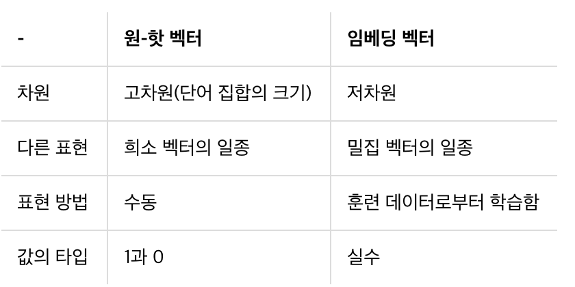

# Word Embeddings

[TOC]

## Intro 

- how embeddings work for representing the semantics of a word

- instead of the word just being a number, using a vector in n-dimensional space.


[말뭉치 - corpus]([https://ko.wikipedia.org/wiki/%EB%A7%90%EB%AD%89%EC%B9%98](https://ko.wikipedia.org/wiki/말뭉치))

자연언어 연구를 위해 특정한 목적을 가지고 **언어의 표본을 추출한 집합**이다. 컴퓨터의 발달로 말뭉치 분석이 용이해졌으며 분석의 정확성을 위해 해당 자연언어를 [형태소 분석](https://ko.wikipedia.org/wiki/형태소_분석)하는 경우가 많다. 확률/통계적 기법과 시계열적인 접근으로 전체를 파악한다. 언어의 빈도와 분포를 확인할 수 있는 자료이며, 현대 언어학 연구에 필수적인 자료이다. 인문학에 자연과학적 방법론이 가장 성공적으로 적용된 경우로 볼 수 있다.


[word embedding](https://3months.tistory.com/136 )

Deep Learning 분야, 이 중에서도 특히 자연어처리에서 필수적으로 알아야할 개념이다. Word Embedding은 Word를 R차원의 Vector로 매핑시켜주는 것을 말한다.




- Words and associated words are clustered as vectors in a multi-dimensional space

- movie review classification; positive and negative


## The IMBD dataset

- tensorflow에서 기본적으로 제공하는 imdb dataset을 사용하여 실습할 것

[Large Movie Review Dataset](http://ai.stanford.edu/~amaas/data/sentiment/)

contains 50,000 movie reviews etc

```
@InProceedings{maas-EtAl:2011:ACL-HLT2011,
  author    = {Maas, Andrew L.  and  Daly, Raymond E.  and  Pham, Peter T.  and  Huang, Dan  and  Ng, Andrew Y.  and  Potts, Christopher},
  title     = {Learning Word Vectors for Sentiment Analysis},
  booktitle = {Proceedings of the 49th Annual Meeting of the Association for Computational Linguistics: Human Language Technologies},
  month     = {June},
  year      = {2011},
  address   = {Portland, Oregon, USA},
  publisher = {Association for Computational Linguistics},
  pages     = {142--150},
  url       = {http://www.aclweb.org/anthology/P11-1015}
}
```


## Looking into the details

- data 준비, tokenizing 시작


## How can we use vectors?

- say a negative review and the words dull and boring show up a lot in the negative review so that they have similar sentiments, and they are close to each other in the sentence. Thus their vectors will be similar.
- Dull and boring
- exciting and fun
- Meaning of the words comes from the labels


## More into the details

```python
import tensorflow as tf # 가장 처음 선언
print(tf.__version__)

# 1.x 버전이면 이거 사용해야 한다. 2.x는 default임
tf.enable_eager_execution()
# 내 환경에서 하면,
# pip install -q tensorflow-datasets


# 데이터 셋 불러오기
# Downloading and preparing dataset imdb_reviews
# info 지금은 사용하지 않는다.
import tensorflow_datasets as tfds
imdb, info = tfds.load("imdb_reviews", with_info=True, as_supervised=True)


import numpy as np
# train과 test를 나눠서 25,000 25,000 으로 저장 한다.
# 영화 리뷰는 X_train
# 테스트용 리뷰는 X_test 저장된다.
train_data, test_data = imdb['train'], imdb['test'] # 25,000 25,000


training_sentences = []
training_labels = []

testing_sentences = []
testing_labels = []

# str(s.tonumpy()) is needed in Python3 instead of just s.numpy()
# converting into other type
for s, l in train_data: ## iterate data
    training_sentences.append(str(s.numpy()))
    training_labels.append(l.numpy())

for s, l in test_data: ## iterate data
    testing_sentences.append(str(s.numpy()))
    testing_labels.append(l.numpy())

training_labels_final = np.array(training_labels) # 타입을 통일시킨다.
testing_labels_final = np.array(testing_labels)

# 0 negative 1 positive
'''''''''''''''''''tokeninzing sentences
vocab_size = 10000 
embedding_dim = 16
max_length = 120 # longer than that can be truncated
trunc_type='post'
oov_tok = "<OOV>"

from tensorflow.keras.preprocessing.text import Tokenizer
from tensorflow.keras.preprocessing.sequence import pad_sequences

tokenizer = Tokenizer(num_words=vocab_size, oov_token=oov_tok)
tokenizer.fit_on_texts(training_sentences)
word_index = tokenizer.word_index

sequences = tokenizer.texts_to_sequences(training_sentences)
# padding sequences
padded = pad_sequences(sequences,maxlen=max_length, truncating=trunc_type)

# oov를 많이 보게 될 것
testing_sequences = tokenizer.texts_to_sequences(testing_sentences)
testing_padded = pad_sequences(testing_sequences,maxlen=max_length)
'''''''''''''''''''


# {hello:1} => {1:hello} 이런식으로 key와 value를 flip
reverse_word_index = dict([(value, key) for (key, value) in word_index.items()])

def decode_review(text):
    return ' '.join([reverse_word_index.get(i, '?') for i in text])

print(decode_review(padded[1]))
print(training_sentences[1])

# define our neural network
# Embedding() : Embedding()은 단어를 밀집 벡터로 만드는 역할을 합니다. 인공 신경망 용어로는 임베딩 층(embedding layer)을 만드는 역할을 합니다. Embedding()은 정수 인코딩이 된 단어들을 입력을 받아서 임베딩을 수행합니다.
# Embedding()은 (number of samples, input_length)인 2D 정수 텐서를 입력받습니다. 이 때 각 sample은 정수 인코딩이 된 결과로, 정수의 시퀀스입니다. Embedding()은 워드 임베딩 작업을 수행하고 (number of samples, input_length, embedding word dimentionality)인 3D 텐서를 리턴합니다.
model = tf.keras.Sequential([
    tf.keras.layers.Embedding(vocab_size, embedding_dim, input_length=max_length),
    tf.keras.layers.Flatten(),
    tf.keras.layers.Dense(6, activation='relu'),
    tf.keras.layers.Dense(1, activation='sigmoid')
])
model.compile(loss='binary_crossentropy',optimizer='adam',metrics=['accuracy'])
model.summary()

'''
Model: "sequential"
_________________________________________________________________
Layer (type)                 Output Shape              Param #   
=================================================================
embedding (Embedding)        (None, 120, 16)           160000    
_________________________________________________________________
flatten (Flatten)            (None, 1920)              0         
_________________________________________________________________
dense (Dense)                (None, 6)                 11526     
_________________________________________________________________
dense_1 (Dense)              (None, 1)                 7         
=================================================================
Total params: 171,533
Trainable params: 171,533
Non-trainable params: 0
_________________________________________________________________
'''

num_epochs = 10
model.fit(padded,
          training_labels_final,
          epochs=num_epochs,
          validation_data=(testing_padded,
                           testing_labels_final))
'''epoch 1번 전체 데이터 학습을 할때마다 acc가 높아진다.
25000/25000 [==============================] - 9s 344us/sample - loss: 0.4941 - acc: 0.7406 - val_loss: 0.3537 - val_acc: 0.8432
Epoch 2/100
25000/25000 [==============================] - 7s 279us/sample - loss: 0.2392 - acc: 0.9066 - val_loss: 0.3651 - val_acc: 0.8404
Epoch 3/100
25000/25000 [==============================] - 7s 285us/sample - loss: 0.0865 - acc: 0.9785 - val_loss: 0.4548 - val_acc: 0.8264
Epoch 4/100
'''
# acc가 1.000인데도 계속 학습하는 경우 overfitting이다.


e = model.layers[0]
weights = e.get_weights()[0]
print(weights.shape) # shape: (vocab_size, embedding_dim) (10000, 16)
# 10000개의 단어 16차원


# file 쓰기
import io
out_v = io.open('vecs.tsv', 'w', encoding='utf-8')
out_m = io.open('meta.tsv', 'w', encoding='utf-8')
for word_num in range(1, vocab_size):
  word = reverse_word_index[word_num]
  embeddings = weights[word_num]
  # words 쓰기
  out_m.write(word + "\n")
  # 
  out_v.write('\t'.join([str(x) for x in embeddings]) + "\n")
out_v.close()
out_m.close()


try:
  from google.colab import files
except ImportError:
  pass
else:
  files.download('vecs.tsv')
  files.download('meta.tsv')


sentence = "I really think this is amazing. honest."
sequence = tokenizer.texts_to_sequences(sentence)
print(sequence)

```


Embedding() 뜯어보기

```python
# 문장 토큰화와 단어 토큰화
text=[['Hope', 'to', 'see', 'you', 'soon'],
      ['Nice', 'to', 'see', 'you', 'again']]

# 각 단어에 대한 정수 인코딩
text=[[0, 1, 2, 3, 4],
      [5, 1, 2, 3, 6]]

# 위 데이터가 아래의 임베딩 층의 입력이 된다.
Embedding(7, 2, input_length=5)
# 7은 단어의 개수. 즉, 단어 집합(vocabulary)의 크기이다.
# 2는 임베딩한 후의 벡터의 크기이다.
# 5는 각 입력 시퀀스의 길이. 즉, input_length이다.

# 각 정수는 아래의 테이블의 인덱스로 사용되며 Embeddig()은 각 단어에 대해 임베딩 벡터를 리턴한다.
+------------+------------+
|   index    | embedding  |
+------------+------------+
|     0      | [1.2, 3.1] |
|     1      | [0.1, 4.2] |
|     2      | [1.0, 3.1] |
|     3      | [0.3, 2.1] |
|     4      | [2.2, 1.4] |
|     5      | [0.7, 1.7] |
|     6      | [4.1, 2.0] |
+------------+------------+
# 위의 표는 임베딩 벡터가 된 결과를 예로서 정리한 것이고 Embedding()의 출력인 3D 텐서를 보여주는 것이 아님.

'''
Embedding()에 넣어야하는 대표적인 인자는 다음과 같습니다.

첫번째 인자 = 단어 집합의 크기. 즉, 총 단어의 개수
두번째 인자 = 임베딩 벡터의 출력 차원. 결과로서 나오는 임베딩 벡터의 크기
input_length = 입력 시퀀스의 길이
'''
```


## Diving into the code 

https://github.com/tensorflow/datasets/tree/master/docs

https://github.com/tensorflow/datasets/blob/d4e0e83a2c7b5ee8b807d036493ef0329e8f446e/docs/catalog/imdb_reviews.md


## week 2 quiz

the purpose of the embedding dimension

- a dense representation of words and their relative meanings
- **Finding nearest neighbors in the embedding space**. These can be used to make recommendations based on user interests or cluster categories.
- As input to a machine learning model for a supervised task.
- For visualization of concepts and relations between categories.

- It is the number of dimensions for the vector representing the word encoding


IMDB Reviews are either positive or negative. What **type of loss function** should be used in this scenario?

- 긍정인지 부정인지에 대한 이진 판별값이 출력이 되기 때문에, 손실 함수는 binary_crossentropy를 사용

- 최적화 함수는 adam을 사용

- ```python
  model.compile(loss='binary_crossentropy', optimizer='adam', metrics=['accuracy'])
  model.fit(X_train, y_train, validation_data=(X_test, y_test), epochs=5, batch_size=64)
  scores = model.evaluate(X_test, y_test, verbose=0) # 테스트 데이터에 대해서 정확도 평가
  print("정확도: %.2f%%" % (scores[1]*100))
  ```


when using IMDB sub words dataset, our results in classification were poor. why?

- Sequence becomes much more important when dealing with subwords, but we're ignoring word positions


when tokenizing a corpus, what does the num_words=n parameter do?

- it specifies the maximum number of words to be tokenized, and picks the most common 'n' words


## Exercise 2 - Explore the BBC news archive


```python
import csv
import tensorflow as tf
print(tf.__version__)

import numpy as np
from tensorflow.keras.preprocessing.text import Tokenizer
from tensorflow.keras.preprocessing.sequence import pad_sequences

# !wget --no-check-certificate \
#     https://storage.googleapis.com/laurencemoroney-blog.appspot.com/bbc-text.csv \
#     -O /tmp/bbc-text.csv

vocab_size = 10000
embedding_dim = 16 # 차원
max_length = 120 # 텍스트 길이
trunc_type = 'post'
padding_type = 'post'
oov_tok = '<OOV>'
training_portion = .8

sentences = []
labels = []
# 불용어 :: 큰 의미가 없는 단어
stopwords = [ "a", "about", "above", "after", "again", "against", "all", "am", "an", "and", "any", "are", "as", "at", "be", "because", "been", "before", "being", "below", "between", "both", "but", "by", "could", "did", "do", "does", "doing", "down", "during", "each", "few", "for", "from", "further", "had", "has", "have", "having", "he", "he'd", "he'll", "he's", "her", "here", "here's", "hers", "herself", "him", "himself", "his", "how", "how's", "i", "i'd", "i'll", "i'm", "i've", "if", "in", "into", "is", "it", "it's", "its", "itself", "let's", "me", "more", "most", "my", "myself", "nor", "of", "on", "once", "only", "or", "other", "ought", "our", "ours", "ourselves", "out", "over", "own", "same", "she", "she'd", "she'll", "she's", "should", "so", "some", "such", "than", "that", "that's", "the", "their", "theirs", "them", "themselves", "then", "there", "there's", "these", "they", "they'd", "they'll", "they're", "they've", "this", "those", "through", "to", "too", "under", "until", "up", "very", "was", "we", "we'd", "we'll", "we're", "we've", "were", "what", "what's", "when", "when's", "where", "where's", "which", "while", "who", "who's", "whom", "why", "why's", "with", "would", "you", "you'd", "you'll", "you're", "you've", "your", "yours", "yourself", "yourselves" ]
print(len(stopwords))
# Expected Output
# 153

with open("bbc-text.csv", 'r') as csvfile:
    # .csv파일을 받아와서 sentences와 labels에 분리하여 추가
    reader = csv.reader(csvfile, delimiter=',')  # ',' 을 기준으로 칸 분리
    next(reader)  # 다음 행을 현재 방언에 따라 구문 분석하여 리스트나 딕셔너리로 반환
    # print(reader)
    for row in reader:
        # row => ['label', 'content']
        labels.append(row[0])
        sentence = row[1]
        for word in stopwords:
            token = ' ' + word + ' '
            sentence = sentence.replace(token, ' ')
            sentence = sentence.replace('  ', ' ')
        sentences.append(sentence)

print(len(labels))
print(len(sentences))
print(sentences[0])
# Expected Output
# 2225
# 2225
# tv future hands viewers home theatre systems
# plasma high-definition tvs  digital video recorders moving
# living room  way people watch tv will radically different five years
# time.  according expert panel gathered annual consumer electronics show las vegas discuss new technologies will impact one favourite pastimes. us leading trend  programmes content will delivered viewers via home networks  cable  satellite  telecoms companies  broadband service providers front rooms portable devices.  one talked-about technologies ces digital personal video recorders (dvr pvr). set-top boxes  like us s tivo uk s sky+ system  allow people record  store  play  pause forward wind tv programmes want.  essentially  technology allows much personalised tv. also built-in high-definition tv sets  big business japan us  slower take off europe lack high-definition programming. not can people forward wind adverts  can also forget abiding network channel schedules  putting together a-la-carte entertainment. us networks cable satellite companies worried means terms advertising revenues well  brand identity  viewer loyalty channels. although us leads technology moment  also concern raised europe  particularly growing uptake services like sky+.  happens today  will see nine months years  time uk   adam hume  bbc broadcast s futurologist told bbc news website. likes bbc  no issues lost advertising revenue yet. pressing issue moment commercial uk broadcasters  brand loyalty important everyone.  will talking content brands rather network brands   said tim hanlon  brand communications firm starcom mediavest.  reality broadband connections  anybody can producer content.  added:  challenge now hard promote programme much choice.   means  said stacey jolna  senior vice president tv guide tv group  way people find content want watch simplified tv viewers. means networks  us terms  channels take leaf google s book search engine future  instead scheduler help people find want watch. kind channel model might work younger ipod generation used taking control gadgets play them. might not suit everyone  panel recognised. older generations comfortable familiar schedules channel brands know getting. perhaps not want much choice put hands  mr hanlon suggested.  end  kids just diapers pushing buttons already - everything possible available   said mr hanlon.  ultimately  consumer will tell market want.   50 000 new gadgets technologies showcased ces  many enhancing tv-watching experience. high-definition tv sets everywhere many new models lcd (liquid crystal display) tvs launched dvr capability built  instead external boxes. one example launched show humax s 26-inch lcd tv 80-hour tivo dvr dvd recorder. one us s biggest satellite tv companies  directtv  even launched branded dvr show 100-hours recording capability  instant replay  search function. set can pause rewind tv 90 hours. microsoft chief bill gates announced pre-show keynote speech partnership tivo  called tivotogo  means people can play recorded programmes windows pcs mobile devices. reflect increasing trend freeing multimedia people can watch want  want.


train_size = int(training_portion * len(labels)) # int(0.8 * len(labels))

# train할 기준으로 사이즈로 자름
train_sentences = sentences[:train_size] 
train_labels = labels[:train_size]

# train할 기준으로 사이즈로 자름
validation_sentences = sentences[train_size:]
validation_labels = labels[train_size:]

# Expected output (if training_portion=.8)
print(train_size) # 1780
print(len(train_sentences)) # 1780
print(len(train_labels)) # 1780
print(len(validation_sentences)) # 445
print(len(validation_labels)) # 445

tokenizer = Tokenizer(num_words=vocab_size, oov_token=oov_tok)
tokenizer.fit_on_texts(train_sentences)
word_index = tokenizer.word_index

train_sequences = tokenizer.texts_to_sequences(train_sentences) # sequence화 하여 라벨링
train_padded = pad_sequences(train_sequences, maxlen=max_length, padding=padding_type) # maxlen을 추가하여 padding

print(len(train_sequences[0])) # 449
print(len(train_padded[0])) # 120

print(len(train_sequences[1])) # 200
print(len(train_padded[1])) # 120

print(len(train_sequences[10])) # 192
print(len(train_padded[10])) # 120

validation_sequences = tokenizer.texts_to_sequences(validation_labels)
validation_padded = pad_sequences(validation_sequences, maxlen=max_length, padding=padding_type) # labels를 sequences화 한 것을 padding

print(len(validation_sequences)) # 445
print(validation_padded.shape) # (445, 120)

# 빈도 높은 단어만 선택하도록 Tokenizer 객체 생성
label_tokenizer = Tokenizer()
# 단어 인덱스 구축
label_tokenizer.fit_on_texts(labels)

# 문자열을 정수 인덱스 리스트로 변환
label_tokenizer = Tokenizer()
label_tokenizer.fit_on_texts(labels)

# np.array :: 차원으로 만들어준다.
'''
np.array([[1, 2], [3, 4]])
=> array([[1, 2],
          [3, 4]])
'''
training_label_seq = np.array(label_tokenizer.texts_to_sequences(train_labels))
# print(training_label_seq)
validation_label_seq = np.array(label_tokenizer.texts_to_sequences(validation_labels))

print(training_label_seq[0]) # [4]
print(training_label_seq[1]) # [2]
print(training_label_seq[2]) # [1]
print(training_label_seq.shape) # (1780, 1)

print(validation_label_seq[0]) # [5]
print(validation_label_seq[1]) # [4]
print(validation_label_seq[2]) # [3]
print(validation_label_seq.shape) # (445, 1)

model = tf.keras.Sequential([
    tf.keras.layers.Embedding(vocab_size, embedding_dim, input_length=max_length),
    tf.keras.layers.GlobalAveragePooling1D(),
    tf.keras.layers.Dense(24, activation='relu'),
    tf.keras.layers.Dense(6, activation='softmax'),
])
model.compile(loss='sparse_categorical_crossentropy',optimizer='adam',metrics=['acc'])
'''
다중 클래스 분류(Multi-class Classification)
이진 분류가 두 개의 선택지 중 하나를 고르는 문제였다면, 세 개 이상의 선택지 중 하나를 고르는 문제를 다중 클래스 분류
'''

model.summary()

# Expected Output
# Layer (type)                 Output Shape              Param #
# =================================================================
# embedding (Embedding)        (None, 120, 16)           16000
# _________________________________________________________________
# global_average_pooling1d (Gl (None, 16)                0
# _________________________________________________________________
# dense (Dense)                (None, 24)                408
# _________________________________________________________________
# dense_1 (Dense)              (None, 6)                 150
# =================================================================
# Total params: 16,558
# Trainable params: 16,558
# Non-trainable params: 0


num_epochs = 30
history = model.fit(
    train_padded,
    training_label_seq,
    epochs=num_epochs,
    validation_data=(validation_padded, validation_label_seq),
    verbose=2

)

import matplotlib.pyplot as plt


def plot_graphs(history, string):
    plt.plot(history.history[string])
    plt.plot(history.history['val_' + string])
    plt.xlabel("Epochs")
    plt.ylabel(string)
    plt.legend([string, 'val_' + string])
    plt.show()


plot_graphs(history, "acc")
plot_graphs(history, "loss")

reverse_word_index = dict([(value, key) for (key, value) in word_index.items()])

def decode_sentence(text):
    return ' '.join([reverse_word_index.get(i, '?') for i in text])


e = model.layers[0]
weights = e.get_weights()[0]
print(weights.shape) # shape: (vocab_size, embedding_dim)
# (1000, 16)


import io

out_v = io.open('vecs.tsv', 'w', encoding='utf-8')
out_m = io.open('meta.tsv', 'w', encoding='utf-8')
for word_num in range(1, vocab_size):
  word = reverse_word_index[word_num]
  embeddings = weights[word_num]
  out_m.write(word + "\n")
  out_v.write('\t'.join([str(x) for x in embeddings]) + "\n")
out_v.close()
out_m.close()


try:
  from google.colab import files
except ImportError:
  pass
else:
  files.download('vecs.tsv')
  files.download('meta.tsv')
```


## :key: Keys

[vector(벡터)](https://ko.khanacademy.org/math/linear-algebra/vectors-and-spaces/vectors/v/real-coordinate-spaces?modal=1) 

-  수의 순서쌍

- 방향이 있고 순서가 있고 차원의 공간에 존재하는 점

```python
import numpy as np
a = np.array([1, 2])
b = np.array([1, 2])
print (a + b)    #결과: array([2, 4])


## 백터와 스칼라(상수) 곱 연산
lista = np.array([1,2,3,4,5])
lista * 2
#결과는 array([2,4,6,8,10])

```

embedding

epoch

- *One Epoch is when an ENTIRE dataset is passed forward and backward through the neural network only ONCE*
- 한 번의 epoch는 인공 신경망에서 전체 데이터 셋에 대해 forward pass/backward pass 과정을 거친 것을 말함. 즉, 전체 데이터 셋에 대해 한 번 학습을 완료한 상태

- **epochs = 40이라면 전체 데이터를 40번 사용해서 학습을 거치는 것입니다.**

overfitting

weight

[Invertible and noninvertibles matrices](https://www.youtube.com/watch?v=kR9rO-6Y2Zk)

기계가 훈련 단계에서 학습한 단어들의 집합을 **단어 집합(vocabulary)** - 기계가 암기한 단어들의 리스트

테스트 단계에서 기계가 미처 배우지 못한 모르는 단어가 등장한다면 이 단어들을 **OOV(Out-Of-Vocabulary)** - 단어 집합에 없는 단어

**내부 단어 분리(Subword Segmentation)**는 기계가 아직 배운 적이 없는 단어더라도 대처할 수 있도록 도와주는 기법


머신러닝 모델의 학습 방법은

1. 데이터를 탐색한 후 전처리하고
2. 데이터 변수 등을 분석하여 전체 훈련용, 테스트용 데이터 셋을 구성한 다음
3. 해결하고자 하는 문제에 맞는 알고리즘을 선택하여 모델을 만든 후
4. **훈련용 데이터 셋으로 모델을 학습**시키고
5. k-folds 교차검증 및 테스트용 데이터 셋 으로 모델 간 검증을 진행하고
6. 최고의 성능을 보이는 모델을 최종 배치한다.


참고문헌:

http://colah.github.io/posts/2014-07-NLP-RNNs-Representations/

https://wikidocs.net/32105