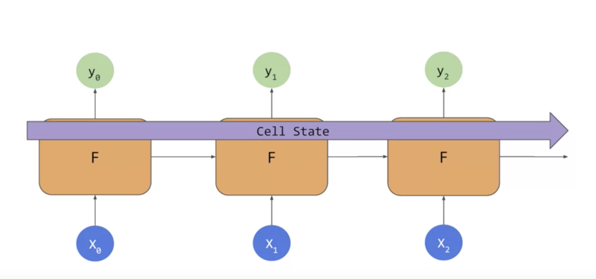
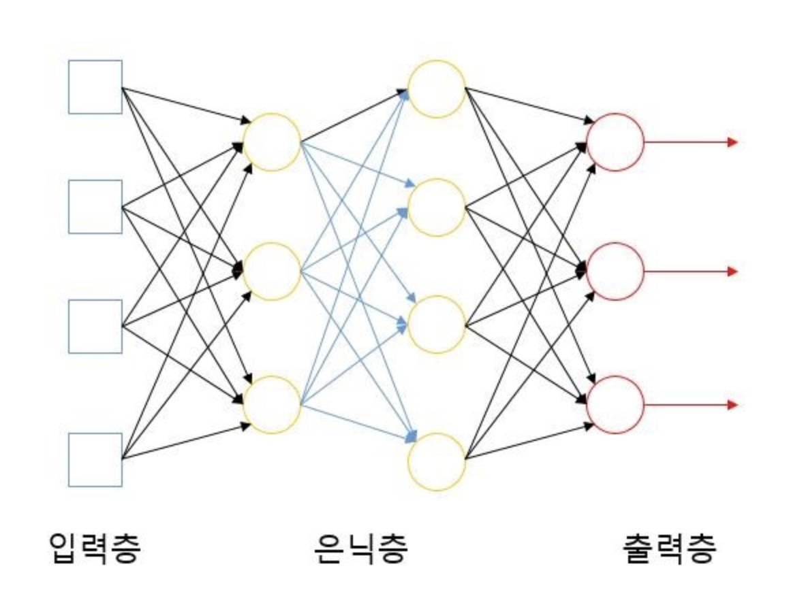

# Sequence Models

[TOC]

## Intro

- how to implement sequence models
- similar meaning으로 labelling하는 것 뿐만아니라
- ordering도 생각하는 것
- The sequencwe of words matters too for the meaning of a sentence

- 불용어가 단어의 의미를 파악하는데 필요하다는 것을 week2에서 확인했음

- data와 labels를 f()안에 넣으면 rules를 갖게 된다.

  f(data, labels) = rules

- RNN


## Andrew's sequence modeling course

https://www.coursera.org/lecture/nlp-sequence-models/deep-rnns-ehs0S


## 순환 신경망(Recurrent Neural Network)

> 용어는 비슷하지만 순환 신경망과 재귀 신경망(Recursive Neural Network)은 전혀 다른 개념

- 시퀀스(Sequence) 모델 : 입력과 출력을 시퀀스 단위로 처리하는 모델
- 번역기를 생각해보면 입력은 번역하고자 하는 문장. 즉, **단어 시퀀스**입니다. 출력에 해당되는 번역된 문장 또한 단어 시퀀스입니다. 

-  RNN은 은닉층의 노드에서 활성화 함수를 통해 나온 **결과값**을 출력층 방향으로도 보내면서, 다시 은닉층 노드의 다음 계산의 입력으로 보내는 특징을 갖고있습니다.


x는 입력층의 입력 벡터

y는 출력층의 출력 벡터

RNN에서 **은닉층에서 활성화 함수를 통해 결과를 내보내는 역할**을 하는 노드를 **셀(cell)**이라고 합니다. 이 셀은 이전의 값을 기억하려고 하는 일종의 메모리 역할을 수행하므로 이를 **메모리 셀** 또는 **RNN 셀**이라고 표현합니다.

은닉층의 메모리 셀은 각각의 시점(time step)에서 바로 이전 시점에서의 은닉층의 메모리 셀에서 나온 값을 자신의 입력으로 사용하는 재귀적 활동을 하고 있습니다.

앞으로는 **현재 시점**을 변수 **t**로 표현

이는 현재 시점 t에서의 메모리 셀이 갖고있는 값은 **과거의 메모리 셀들의 값에 영향을 받은 것**임을 의미합니다. 그렇다면 메모리 셀이 갖고 있는 이 값은 뭐라고 부를까요?

메모리 셀이 출력층 방향으로 또는 다음 시점 t+1의 자신에게 보내는 값을 **은닉 상태(hidden state)**라고 합니다. 다시 말해 t 시점의 메모리 셀은 t-1 시점의 메모리 셀이 보낸 은닉 상태값을 **t 시점의 은닉 상태 계산을 위한 입력값으로 사용**합니다.


단어 시퀀스에 대해서 하나의 출력(many-to-one)을 하는 모델은 

- 입력 문서가 긍정적인지 부정적인지를 판별하는 감성 분류(sentiment classification)
- 메일이 정상 메일인지 스팸 메일인지 판별하는 스팸 메일 분류(spam detection)에 사용


현재 시점 t에서 은닉 상태값을 ht라고 정의

은닉층의 메모리 셀은 ht를 계산하기 위해서 총 두 개의 가중치를 갖는다.

Wh, Wx


## 장단기 메모리(Long Short-Term Memory, LSTM)

- 바닐라 RNN의 한계 극복은 위한 변형된 형태의 하나

  - 바닐라 RNN의 한계란? **장기 의존성 문제(the problem of Long-Term Dependencies)**

    - 바닐라 RNN은 출력 결과가 이전의 계산 결과에 의족한다
    - 하지만, 바닐라 RNN은 비교적 짧은 sequence에 대해서만 효과를 보인다
    - 때문에 바닐라 RNN은 시점(time step)이 길어질 수록 앞의 정보가 뒤로 충분히 전달되지 못하는 현상이 발생한다.

    

    - x1을 보면, 시점이 지날 수록 x1의 정보량이 손실되어가는 과정을 볼 수 있다.

- LSTM은 은닉층의 메모리 셀에 **입력 게이트, 망각 게이트, 출력 게이트**를 추가하여 불필요한 기억을 지우고, 기억해야할 것들을 정합니다. 

Today has a beautiful blue <...>

Today has a beautiful blue **sky** 

- blue라는 clue로 맥락상 sky가 올 수 있다고 예측

I lived in Ireland, so at school they made me learn how to speak <...>

I lived in Ireland, so at school they made me learn how to speak **Gaelic**

- Gaelic -> language
- Irish -> people
- Ireland 때문



RNN과 비교하여 **cell state**가 존재

earlier token이 relevent한 later token에도 연결 될 수 있도록 하는 기능 

https://www.coursera.org/lecture/nlp-sequence-models/long-short-term-memory-lstm-KXoay


## Implementing LSTMs in code

tf.keras.layers.Bidirectional(tf.keras.layers.LSTM(64, return_sequences=True)) 

return_sequences=True -> 처리를 함으로써 그 다음 output에 영향을 줄 수 있다.

64 -> The parameter passed in is the number of 

outputs


## Accuracy and loss


10 epochs

50 epochs

2 layer LSTM이 더 accuracy가 높음


## LSTMs

- train_loss(노란색) : 훈련 손실값이며 x축은 에포크 수, 좌측 y축은 손실값을 나타냅니다.
- val_loss(빨간색) : 검증 손실값이며 x축은 에포크 수, 좌측 y축은 손실값을 나타냅니다.
- train_acc(파란색) : 훈련 정확도이며 x축은 에포크 수, 우측 y축은 정확도를 나타냅니다.
- val_acc(녹색) : 검증 정확도이며 x축은 에포크 수, 우측 y축은 정확도를 나타냅니다.


## Using a convolutional network


## IMDB dataset

### Single Layer LSTM

[https://colab.research.google.com/github/lmoroney/dlaicourse/blob/master/TensorFlow%20In%20Practice/Course%203%20-%20NLP/Course%203%20-%20Week%203%20-%20Lesson%201a.ipynb#scrollTo=Aclov8NVMJml](https://colab.research.google.com/github/lmoroney/dlaicourse/blob/master/TensorFlow In Practice/Course 3 - NLP/Course 3 - Week 3 - Lesson 1a.ipynb#scrollTo=Aclov8NVMJml)


```python


```


## Multiple Layer LSTM


```python

```


```python
import json
import tensorflow as tf

from tensorflow.keras.preprocessing.text import Tokenizer
from tensorflow.keras.preprocessing.sequence import pad_sequences

!wget --no-check-certificate \
    https://storage.googleapis.com/laurencemoroney-blog.appspot.com/sarcasm.json \
    -O /tmp/sarcasm.json

vocab_size = 1000
embedding_dim = 16
max_length = 120
trunc_type='post'
padding_type='post'
oov_tok = "<OOV>"
training_size = 20000


with open("/tmp/sarcasm.json", 'r') as f:
    datastore = json.load(f)


sentences = []
labels = []
urls = []
for item in datastore:
    sentences.append(item['headline'])
    labels.append(item['is_sarcastic'])

training_sentences = sentences[0:training_size]
testing_sentences = sentences[training_size:]
training_labels = labels[0:training_size]
testing_labels = labels[training_size:]

tokenizer = Tokenizer(num_words=vocab_size, oov_token=oov_tok)
tokenizer.fit_on_texts(training_sentences)

word_index = tokenizer.word_index

training_sequences = tokenizer.texts_to_sequences(training_sentences)
training_padded = pad_sequences(training_sequences, maxlen=max_length, padding=padding_type, truncating=trunc_type)

testing_sequences = tokenizer.texts_to_sequences(testing_sentences)
testing_padded = pad_sequences(testing_sequences, maxlen=max_length, padding=padding_type, truncating=trunc_type)

model = tf.keras.Sequential([
    tf.keras.layers.Embedding(vocab_size, embedding_dim, input_length=max_length),
    tf.keras.layers.Bidirectional(tf.keras.layers.LSTM(32)),
    tf.keras.layers.Dense(24, activation='relu'),
    tf.keras.layers.Dense(1, activation='sigmoid')
])
model.compile(loss='binary_crossentropy',optimizer='adam',metrics=['accuracy'])
model.summary()

num_epochs = 50
training_padded = np.array(training_padded)
training_labels = np.array(training_labels)
testing_padded = np.array(testing_padded)
testing_labels = np.array(testing_labels)
history = model.fit(training_padded, training_labels, epochs=num_epochs, validation_data=(testing_padded, testing_labels), verbose=1)
```


```python
import json
import tensorflow as tf

from tensorflow.keras.preprocessing.text import Tokenizer
from tensorflow.keras.preprocessing.sequence import pad_sequences

!wget --no-check-certificate \
    https://storage.googleapis.com/laurencemoroney-blog.appspot.com/sarcasm.json \
    -O /tmp/sarcasm.json

vocab_size = 1000
embedding_dim = 16
max_length = 120
trunc_type='post'
padding_type='post'
oov_tok = "<OOV>"
training_size = 20000


with open("/tmp/sarcasm.json", 'r') as f:
    datastore = json.load(f)


sentences = []
labels = []
urls = []
for item in datastore:
    sentences.append(item['headline'])
    labels.append(item['is_sarcastic'])

training_sentences = sentences[0:training_size]
testing_sentences = sentences[training_size:]
training_labels = labels[0:training_size]
testing_labels = labels[training_size:]

tokenizer = Tokenizer(num_words=vocab_size, oov_token=oov_tok)
tokenizer.fit_on_texts(training_sentences)

word_index = tokenizer.word_index

training_sequences = tokenizer.texts_to_sequences(training_sentences)
training_padded = pad_sequences(training_sequences, maxlen=max_length, padding=padding_type, truncating=trunc_type)

testing_sequences = tokenizer.texts_to_sequences(testing_sentences)
testing_padded = pad_sequences(testing_sequences, maxlen=max_length, padding=padding_type, truncating=trunc_type)

model = tf.keras.Sequential([
    tf.keras.layers.Embedding(vocab_size, embedding_dim, input_length=max_length),
    tf.keras.layers.Conv1D(128, 5, activation='relu'),
    tf.keras.layers.GlobalMaxPooling1D(),
    tf.keras.layers.Dense(24, activation='relu'),
    tf.keras.layers.Dense(1, activation='sigmoid')
])
model.compile(loss='binary_crossentropy',optimizer='adam',metrics=['accuracy'])
model.summary()

num_epochs = 50
history = model.fit(training_padded, training_labels, epochs=num_epochs, validation_data=(testing_padded, testing_labels), verbose=1)

```


## Exercise 3- Exploring overfitting in NLP

https://www.kaggle.com/kazanova/sentiment140

https://nlp.stanford.edu/projects/glove/

트위터 데이터 사용

1. **target**: the polarity of the tweet (*0* = negative, *2* = neutral, *4* = positive)
2. **ids**: The id of the tweet ( *2087*)
3. **date**: the date of the tweet (*Sat May 16 23:58:44 UTC 2009*)
4. **flag**: The query (*lyx*). If there is no query, then this value is NO_QUERY.
5. **user**: the user that tweeted (*robotickilldozr*)
6. **text**: the text of the tweet (*Lyx is cool*)


```python
# -*- coding: utf-8 -*-
"""NLP Course - Week 3 Exercise Question.ipynb
Automatically generated by Colaboratory.
Original file is located at
    https://colab.research.google.com/github/lmoroney/dlaicourse/blob/master/TensorFlow%20In%20Practice/Course%203%20-%20NLP/NLP%20Course%20-%20Week%203%20Exercise%20Question.ipynb
"""

import json
import tensorflow as tf
import csv
import random
import numpy as np

from tensorflow.keras.preprocessing.text import Tokenizer
from tensorflow.keras.preprocessing.sequence import pad_sequences
from tensorflow.keras.utils import to_categorical
from tensorflow.keras import regularizers


embedding_dim = 100
max_length = 16
trunc_type='post'
padding_type='post'
oov_tok = "<OOV>"
training_size=160000  #Your dataset size here. Experiment using smaller values (i.e. 16000), but don't forget to train on at least 160000 to see the best effects
test_portion=.1

corpus = []


# Note that I cleaned the Stanford dataset to remove LATIN1 encoding to make it easier for Python CSV reader
# You can do that yourself with:
# iconv -f LATIN1 -t UTF8 training.1600000.processed.noemoticon.csv -o training_cleaned.csv
# I then hosted it on my site to make it easier to use in this notebook

!wget --no-check-certificate \
    https://storage.googleapis.com/laurencemoroney-blog.appspot.com/training_cleaned.csv \
    -O /tmp/training_cleaned.csv

num_sentences = 0

with open("/tmp/training_cleaned.csv") as csvfile:
    reader = csv.reader(csvfile, delimiter=',')
    for row in reader:
        list_item=[]
        list_item.append(row[5])
        this_label=row[0]
        if this_label=='0':
            list_item.append(0)
        else:
            list_item.append(1)
        num_sentences = num_sentences + 1
        corpus.append(list_item)

print(num_sentences)
print(len(corpus))
print(corpus[1])

# Expected Output:
# 1600000
# 1600000
# ["is upset that he can't update his Facebook by texting it... and might cry as a result  School today also. Blah!", 0]

sentences=[]
labels=[]
random.shuffle(corpus)
for x in range(training_size):
    sentences.append(corpus[x][0])
    labels.append(corpus[x][1])


tokenizer = Tokenizer()
tokenizer.fit_on_texts(sentences)

word_index = tokenizer.word_index
vocab_size=len(word_index)

sequences = tokenizer.texts_to_sequences(sentences)
padded = pad_sequences(sequences, maxlen=max_length, padding=padding_type, truncating=trunc_type)

split = int(test_portion * training_size)

test_sequences = padded[0:split]
training_sequences = padded[split:training_size]
test_labels = labels[0:split]
training_labels = labels[split:training_size]

print(vocab_size)
print(word_index['i'])
# Expected Output
# 138858
# 1

# Note this is the 100 dimension version of GloVe from Stanford
# I unzipped and hosted it on my site to make this notebook easier
!wget --no-check-certificate \
    https://storage.googleapis.com/laurencemoroney-blog.appspot.com/glove.6B.100d.txt \
    -O /tmp/glove.6B.100d.txt
embeddings_index = {};
with open('/tmp/glove.6B.100d.txt') as f:
    for line in f:
        values = line.split();
        word = values[0];
        coefs = np.asarray(values[1:], dtype='float32');
        embeddings_index[word] = coefs;

embeddings_matrix = np.zeros((vocab_size+1, embedding_dim));
for word, i in word_index.items():
    embedding_vector = embeddings_index.get(word);
    if embedding_vector is not None:
        embeddings_matrix[i] = embedding_vector;

print(len(embeddings_matrix))
# Expected Output
# 138859

model = tf.keras.Sequential([
    tf.keras.layers.Embedding(vocab_size+1, embedding_dim, input_length=max_length, weights=[embeddings_matrix], trainable=False),
    tf.keras.layers.Dropout(0.2),
    tf.keras.layers.Conv1D(64, 5, activation='relu'),
    tf.keras.layers.MaxPooling1D(pool_size=4),
    tf.keras.layers.LSTM(64),
    tf.keras.layers.Dense(1, activation='sigmoid')
])
model.compile(loss='binary_crossentropy',optimizer='adam',metrics=['accuracy'])
model.summary()

num_epochs = 50
history = model.fit(training_sequences, training_labels, epochs=num_epochs, validation_data=(test_sequences, test_labels), verbose=2)

print("Training Complete")

'''
_________________________________________________________________
Layer (type)                 Output Shape              Param #   
=================================================================
embedding (Embedding)        (None, 16, 100)           13838100  
_________________________________________________________________
dropout (Dropout)            (None, 16, 100)           0         
_________________________________________________________________
conv1d (Conv1D)              (None, 12, 64)            32064     
_________________________________________________________________
max_pooling1d (MaxPooling1D) (None, 3, 64)             0         
_________________________________________________________________
lstm (LSTM)                  (None, 64)                33024     
_________________________________________________________________
dense (Dense)                (None, 1)                 65        
=================================================================
Total params: 13,903,253
Trainable params: 65,153
Non-trainable params: 13,838,100
_________________________________________________________________
Train on 144000 samples, validate on 16000 samples
Epoch 1/50
144000/144000 - 47s - loss: 0.5668 - acc: 0.6986 - val_loss: 0.5240 - val_acc: 0.7381 
...
'''

import matplotlib.image  as mpimg
import matplotlib.pyplot as plt

#-----------------------------------------------------------
# Retrieve a list of list results on training and test data
# sets for each training epoch
#-----------------------------------------------------------
acc=history.history['acc']
val_acc=history.history['val_acc']
loss=history.history['loss']
val_loss=history.history['val_loss']

epochs=range(len(acc)) # Get number of epochs

#------------------------------------------------
# Plot training and validation accuracy per epoch
#------------------------------------------------
plt.plot(epochs, acc, 'r')
plt.plot(epochs, val_acc, 'b')
plt.title('Training and validation accuracy')
plt.xlabel("Epochs")
plt.ylabel("Accuracy")
plt.legend(["Accuracy", "Validation Accuracy"])

plt.figure()

#------------------------------------------------
# Plot training and validation loss per epoch
#------------------------------------------------
plt.plot(epochs, loss, 'r')
plt.plot(epochs, val_loss, 'b')
plt.title('Training and validation loss')
plt.xlabel("Epochs")
plt.ylabel("Loss")
plt.legend(["Loss", "Validation Loss"])

plt.figure()


# Expected Output
# A chart where the validation loss does not increase sharply!


```


## week 3 quiz


**Why does sequence make a large difference when determining semantics of language?**

- Because the order in which words appear dictate their impact on the meaning of the sentence


**How do Recurrent Neural Networks help you understand the impact of sequence on meaning?**

- They carry meaning from one cell to the next


**How does an LSTM help understand meaning when words that qualify each other aren’t necessarily beside each other in a sentence?**

- Values from eariler words can be carried to later ones via a cell state


**What keras layer type allows LSTMs to look forward and backward in a sentence?**

- Bidirectional


**What’s the output shape of a bidirectional LSTM layer with 64 units?**

- (None, 128)


**When stacking LSTMs, how do you instruct an LSTM to feed the next one in the sequence?**

- Ensure the return_sequences is set to True only on units that feed to another LSTM


## :key: Keys

시퀀스-투-시퀀스(Sequence-to-Sequence), seq2seq

- 번역기에서 대표적으로 사용되는 seq2seq 모델


-  seq2seq 모델 내부


- 크게 두 개로 구성된 아키텍처로 구성되는데, 바로 인코더와 디코더

- 인코더는 입력 문장의 모든 단어들을 순차적으로 입력받은 뒤에 

  마지막에 이 모든 단어 정보들을 압축해서 하나의 벡터로 만드는데, 이를 **컨텍스트 벡터(context vector)** 라고 한다.


- 입력 문장의 정보가 하나의 컨텍스트 벡터로 모두 압축되면, 인코더는 컨텍스트 벡터를 디코더로 전송

- 디코더는 컨텍스트 벡터를 받아서 번역된 단어를 한 개씩 순차적으로 출력


- 인코더 아키텍처와 디코더 아키텍처의 내부는 사실 두 개의 RNN 아키텍처
- 인코더: 입력 문장을 받는 RNN 셀
- 디코더: 출력 문장을 출력하는 RNN 셀





**입력층의 노드**들은 **들어온 신호를 그대로 다음 노드에 전달**하는 창구 역할만 합니다. 즉, 입력층 노드에서는 앞에서 설명한 가중합이나 활성함수 **계산을 하지 않습니다.**
이러한 이유로 입력층의 노드는 다른 노드와 다르게 사각형으로 표시 했습니다.

한편 가장 오른쪽에 배열된 노드들은 **'출력층'** 이라고 합니다. 이 노드들의 **출력이 신경망의 최종 결과값**이 됩니다.

입력층과 출력층 사이에 있는 계층들은 **'은닉층'** 이라고 부릅니다. **신경망의 외부에서는 이 계층의 노드들에 직접 접근할 수가 없어**서 이런 이름이 붙었습니다.

**입력층 - 출력층**으로만 구성된 신경망을 **'단층 신경망'** 이라고 합니다.
**단층 신경망에 은닉층이 추가**된 신경망은 **'다층 신경망'** 이라고 합니다.
**다층 신경망**은 **입력층 - 은닉층(들) - 출력층** 으로 구성


참고문헌:

https://m.blog.naver.com/PostView.nhn?blogId=infoefficien&logNo=220902818960&proxyReferer=https%3A%2F%2Fwww.google.com%2F

[http://www.kwangsiklee.com/2018/11/keras%EC%97%90%EC%84%9C-sequence%EB%A5%BC-%EC%9D%B4%EC%9A%A9%ED%95%98%EC%97%AC-%EB%8C%80%EC%9A%A9%EB%9F%89-%EB%8D%B0%EC%9D%B4%ED%84%B0%EC%85%8B-%EC%B2%98%EB%A6%AC%ED%95%98%EA%B8%B0/](http://www.kwangsiklee.com/2018/11/keras에서-sequence를-이용하여-대용량-데이터셋-처리하기/)