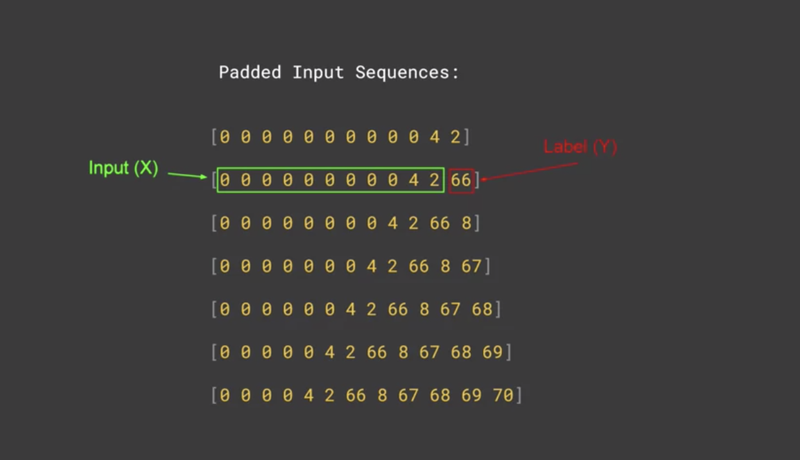

# Sequence models and literature

[TOC]


## Intro

- shakespeare 같은 문장 만들기

- generate new text


import

tokenizing text corpus

Iterate line by line

pad

Create predictors and labels



sequence

LSTM

generate new text


문장을 생성할때 a lot of repetition of words가 발생하는 이유는 LSTM was only carrying context forward하기 때문.


https://storage.googleapis.com/laurencemoroney-blog.appspot.com/irish-lyrics-eof.txt

https://www.tensorflow.org/tutorials/text/text_generation

https://colab.research.google.com/github/tensorflow/docs/blob/master/site/ko/tutorials/text/text_generation.ipynb#scrollTo=pD_55cOxLkAb


문자 기반 순환 신경망(RNN, Recurrent Neural Network)을 사용하여 어떻게 텍스트를 생성하는지 설명합니다. 

Andrej Karpathy의 [순환 신경망의 뛰어난 효율](http://karpathy.github.io/2015/05/21/rnn-effectiveness/)에서 가져온 셰익스피어 데이터셋으로 작업할 것입니다. 

이 데이터 셋에서 문자 시퀀스 ("Shakespear")가 주어지면, 시퀀스의 다음 문자("e")를 예측하는 모델을 훈련합니다. 모델을 반복하여 호출하면 더 긴 텍스트 시퀀스 생성이 가능합니다.


이 모델은 단어의 의미를 학습하지는 않았지만, 고려해야 할 점으로:

- 모델은 문자 기반입니다. 훈련이 시작되었을 때, 이 모델은 영어 단어의 철자를 모르거나 심지어 텍스트의 단위가 단어라는 것도 모릅니다.
- 출력의 구조는 대본과 유사합니다. 즉, 텍스트 블록은 대개 화자의 이름으로 시작하고 이 이름들은 모든 데이터셋에서 대문자로 씌여 있습니다.
- 아래에 설명된 것처럼 이 모델은 작은 텍스트 배치(각 100자)로 훈련되었으며 논리적인 구조를 가진 더 긴 텍스트 시퀀스를 생성할 수 있습니다.


데이터 읽기

```python

from __future__ import absolute_import, division, print_function, unicode_literals

!pip install -q tensorflow-gpu==2.0.0
import tensorflow as tf

import numpy as np
import os
import time

## 텍스트 불러오기
path_to_file = tf.keras.utils.get_file('shakespeare.txt', 'https://storage.googleapis.com/download.tensorflow.org/data/shakespeare.txt')

# 읽은 다음 파이썬 2와 호환되도록 디코딩합니다.
text = open(path_to_file, 'rb').read().decode(encoding='utf-8')
# 텍스트의 길이는 그 안에 있는 문자의 수입니다.
print ('텍스트의 길이: {}자'.format(len(text)))

# 텍스트의 처음 250자를 살펴봅니다
print(text[:250])


# 파일의 고유 문자수를 출력합니다.
vocab = sorted(set(text))
print ('고유 문자수 {}개'.format(len(vocab)))

```

텍스트 벡터화

훈련 전, 문자들을 수치화할 필요가 있습니다. 두 개의 조회 테이블(lookup table)을 만듭니다: 하나는 문자를 숫자에 매핑하고 다른 하나는 숫자를 문자에 매핑하는 것입니다.

```python
# 고유 문자에서 인덱스로 매핑 생성
char2idx = {u:i for i, u in enumerate(vocab)}
idx2char = np.array(vocab)

text_as_int = np.array([char2idx[c] for c in text])

print('{')
for char,_ in zip(char2idx, range(20)):
    print('  {:4s}: {:3d},'.format(repr(char), char2idx[char]))
print('  ...\n}')

# 텍스트에서 처음 13개의 문자가 숫자로 어떻게 매핑되었는지를 보여줍니다
print ('{} ---- 문자들이 다음의 정수로 매핑되었습니다 ---- > {}'.format(repr(text[:13]), text_as_int[:13]))

```


예측 과정

주어진 문자나 문자 시퀀스가 주어졌을 때, 다음 문자로 가장 가능성 있는 문자는 무엇일까요? 이는 모델을 훈련하여 수행할 작업입니다. 모델의 입력은 문자열 시퀀스가 될 것이고, 모델을 훈련시켜 출력을 예측합니다. 이 출력은 현재 타임 스텝(time step)의 다음 문자입니다.

RNN은 이전에 본 요소에 의존하는 내부 상태를 유지하고 있으므로, 이 순간까지 계산된 모든 문자를 감안할 때, 다음 문자는 무엇일까요?

훈련 샘플과 타깃 만들기

다음으로 텍스트를 샘플 시퀀스로 나눕니다. 각 입력 시퀀스에는 텍스트에서 나온 `seq_length`개의 문자가 포함될 것입니다.

각 입력 시퀀스에서, 해당 타깃은 한 문자를 오른쪽으로 이동한 것을 제외하고는 동일한 길이의 텍스트를 포함합니다.

따라서 텍스트를`seq_length + 1`개의 청크(chunk)로 나눕니다. 예를 들어, `seq_length`는 4이고 텍스트를 "Hello"이라고 가정해 봅시다. 입력 시퀀스는 "Hell"이고 타깃 시퀀스는 "ello"가 됩니다.

이렇게 하기 위해 먼저 [`tf.data.Dataset.from_tensor_slices`](https://www.tensorflow.org/api_docs/python/tf/data/Dataset#from_tensor_slices) 함수를 사용해 텍스트 벡터를 문자 인덱스의 스트림으로 변환합니다.


```python
# 단일 입력에 대해 원하는 문장의 최대 길이
seq_length = 100
examples_per_epoch = len(text)//seq_length

# 훈련 샘플/타깃 만들기
char_dataset = tf.data.Dataset.from_tensor_slices(text_as_int)

for i in char_dataset.take(5):
  print(idx2char[i.numpy()])
  
##batch 메서드는 이 개별 문자들을 원하는 크기의 시퀀스로 쉽게 변환할 수 있습니다.
sequences = char_dataset.batch(seq_length+1, drop_remainder=True)

for item in sequences.take(5):
  print(repr(''.join(idx2char[item.numpy()])))
  
  
# 각 시퀀스에서, map 메서드를 사용해 각 배치에 간단한 함수를 적용하고 입력 텍스트와 타깃 텍스트를 복사 및 이동합니다:
def split_input_target(chunk):
    input_text = chunk[:-1]
    target_text = chunk[1:]
    return input_text, target_text

dataset = sequences.map(split_input_target)


# 첫 번째 샘플의 타깃 값을 출력합니다:
for input_example, target_example in  dataset.take(1):
  print ('입력 데이터: ', repr(''.join(idx2char[input_example.numpy()])))
  print ('타깃 데이터: ', repr(''.join(idx2char[target_example.numpy()])))
  
'''
이 벡터의 각 인덱스는 하나의 타임 스텝(time step)으로 처리됩니다. 타임 스텝 0의 입력으로 모델은 "F"의 인덱스를 받고 다음 문자로 "i"의 인덱스를 예측합니다. 다음 타임 스텝에서도 같은 일을 하지만 RNN은 현재 입력 문자 외에 이전 타임 스텝의 컨텍스트(context)를 고려합니다.
'''
for i, (input_idx, target_idx) in enumerate(zip(input_example[:5], target_example[:5])):
    print("{:4d}단계".format(i))
    print("  입력: {} ({:s})".format(input_idx, repr(idx2char[input_idx])))
    print("  예상 출력: {} ({:s})".format(target_idx, repr(idx2char[target_idx])))
```

훈련 배치 생성

텍스트를 다루기 쉬운 시퀀스로 분리하기 위해 [`tf.data`](https://www.tensorflow.org/api_docs/python/tf/data)를 사용했습니다. 그러나 이 데이터를 모델에 넣기 전에 데이터를 섞은 후 배치를 만들어야 합니다.

```python
# 배치 크기
BATCH_SIZE = 64

# 데이터셋을 섞을 버퍼 크기
# (TF 데이터는 무한한 시퀀스와 함께 작동이 가능하도록 설계되었으며,
# 따라서 전체 시퀀스를 메모리에 섞지 않습니다. 대신에,
# 요소를 섞는 버퍼를 유지합니다).
BUFFER_SIZE = 10000

dataset = dataset.shuffle(BUFFER_SIZE).batch(BATCH_SIZE, drop_remainder=True)

dataset
```

모델 설계

모델을 정의하려면 [`tf.keras.Sequential`](https://www.tensorflow.org/api_docs/python/tf/keras/Sequential)을 사용합니다. 이 간단한 예제에서는 3개의 층을 사용하여 모델을 정의합니다:

- [`tf.keras.layers.Embedding`](https://www.tensorflow.org/api_docs/python/tf/keras/layers/Embedding) : 입력층. `embedding_dim` 차원 벡터에 각 문자의 정수 코드를 매핑하는 훈련 가능한 검색 테이블.
- [`tf.keras.layers.GRU`](https://www.tensorflow.org/api_docs/python/tf/keras/layers/GRU) : 크기가 `units = rnn_units`인 RNN의 유형(여기서 LSTM층을 사용할 수도 있습니다.)
- [`tf.keras.layers.Dense`](https://www.tensorflow.org/api_docs/python/tf/keras/layers/Dense) : 크기가 `vocab_size`인 출력을 생성하는 출력층.


```python
# 문자로 된 어휘 사전의 크기
vocab_size = len(vocab)

# 임베딩 차원
embedding_dim = 256

# RNN 유닛(unit) 개수
rnn_units = 1024

def build_model(vocab_size, embedding_dim, rnn_units, batch_size):
  model = tf.keras.Sequential([
    tf.keras.layers.Embedding(vocab_size, embedding_dim,
                              batch_input_shape=[batch_size, None]),
    tf.keras.layers.LSTM(rnn_units,
                        return_sequences=True,
                        stateful=True,
                        recurrent_initializer='glorot_uniform'),
    tf.keras.layers.Dense(vocab_size)
  ])
  return model


model = build_model(
  vocab_size = len(vocab),
  embedding_dim=embedding_dim,
  rnn_units=rnn_units,
  batch_size=BATCH_SIZE)
```


각 문자에 대해 모델은 임베딩을 검색하고, 임베딩을 입력으로 하여 GRU를 1개의 타임 스텝으로 실행하고, 완전연결층을 적용하여 다음 문자의 로그 가능도(log-likelihood)를 예측하는 로직을 생성합니다:


모델 사용

이제 모델을 실행하여 원하는대로 동작하는지 확인합니다.

먼저 출력의 형태를 확인합니다:

```python
for input_example_batch, target_example_batch in dataset.take(1):
  example_batch_predictions = model(input_example_batch)
  print(example_batch_predictions.shape, "# (배치 크기, 시퀀스 길이, 어휘 사전 크기)")
  
model.summary()

sampled_indices = tf.random.categorical(example_batch_predictions[0], num_samples=1)
sampled_indices = tf.squeeze(sampled_indices,axis=-1).numpy()

print("입력: \n", repr("".join(idx2char[input_example_batch[0]])))
print()
print("예측된 다음 문자: \n", repr("".join(idx2char[sampled_indices ])))


def loss(labels, logits):
  return tf.keras.losses.sparse_categorical_crossentropy(labels, logits, from_logits=True)

example_batch_loss  = loss(target_example_batch, example_batch_predictions)
print("예측 배열 크기(shape): ", example_batch_predictions.shape, " # (배치 크기, 시퀀스 길이, 어휘 사전 크기")
print("스칼라 손실:          ", example_batch_loss.numpy().mean())

model.compile(optimizer='adam', loss=loss)


# 체크포인트가 저장될 디렉토리
checkpoint_dir = './training_checkpoints'
# 체크포인트 파일 이름
checkpoint_prefix = os.path.join(checkpoint_dir, "ckpt_{epoch}")

checkpoint_callback=tf.keras.callbacks.ModelCheckpoint(
    filepath=checkpoint_prefix,
    save_weights_only=True)


EPOCHS=10


history = model.fit(dataset, epochs=EPOCHS, callbacks=[checkpoint_callback])

'''
텍스트 생성
최근 체크포인트 복원
이 예측 단계를 간단히 유지하기 위해 배치 크기로 1을 사용합니다.

RNN 상태가 타임 스텝에서 타임 스텝으로 전달되는 방식이기 때문에 모델은 한 번 빌드된 고정 배치 크기만 허용합니다.

다른 배치 크기로 모델을 실행하려면 모델을 다시 빌드하고 체크포인트에서 가중치를 복원해야 합니다.
'''
tf.train.latest_checkpoint(checkpoint_dir)


model = build_model(vocab_size, embedding_dim, rnn_units, batch_size=1)

model.load_weights(tf.train.latest_checkpoint(checkpoint_dir))

model.build(tf.TensorShape([1, None]))

model.summary()

def generate_text(model, start_string):
  # 평가 단계 (학습된 모델을 사용하여 텍스트 생성)

  # 생성할 문자의 수
  num_generate = 1000

  # 시작 문자열을 숫자로 변환(벡터화)
  input_eval = [char2idx[s] for s in start_string]
  input_eval = tf.expand_dims(input_eval, 0)

  # 결과를 저장할 빈 문자열
  text_generated = []

  # 온도가 낮으면 더 예측 가능한 텍스트가 됩니다.
  # 온도가 높으면 더 의외의 텍스트가 됩니다.
  # 최적의 세팅을 찾기 위한 실험
  temperature = 1.0

  # 여기에서 배치 크기 == 1
  model.reset_states()
  for i in range(num_generate):
      predictions = model(input_eval)
      # 배치 차원 제거
      predictions = tf.squeeze(predictions, 0)

      # 범주형 분포를 사용하여 모델에서 리턴한 단어 예측
      predictions = predictions / temperature
      predicted_id = tf.random.categorical(predictions, num_samples=1)[-1,0].numpy()

      # 예측된 단어를 다음 입력으로 모델에 전달
      # 이전 은닉 상태와 함께
      input_eval = tf.expand_dims([predicted_id], 0)

      text_generated.append(idx2char[predicted_id])

  return (start_string + ''.join(text_generated))

print(generate_text(model, start_string=u"ROMEO: "))
```


# 원-핫 인코딩(One-hot encoding)

- 원-핫 인코딩은 단어 집합의 크기를 벡터의 차원으로 하고, 표현하고 싶은 단어의 인덱스에 1의 값을 부여하고, 다른 인덱스에는 0을 부여하는 단어의 벡터 표현 방식입니다. 이렇게 표현된 벡터를 원-핫 벡터(One-hot vector)라고 합니다.
- 원-핫 인코딩을 두 가지 과정으로 정리해보겠습니다.
  (1) 각 단어에 고유한 인덱스를 부여합니다. (정수 인코딩)
  (2) 표현하고 싶은 단어의 인덱스의 위치에 1을 부여하고, 다른 단어의 인덱스의 위치에는 0을 부여합니다.


to_categorical()

```python
from tensorflow.keras.preprocessing.text import Tokenizer
from tensorflow.keras.utils import to_categorical

text="나랑 점심 먹으러 갈래 점심 메뉴는 햄버거 갈래 갈래 햄버거 최고야"

t = Tokenizer()
t.fit_on_texts([text])
print(t.word_index) # 각 단어에 대한 인코딩 결과 출력.
# {'갈래': 1, '점심': 2, '햄버거': 3, '나랑': 4, '먹으러': 5, '메뉴는': 6, '최고야': 7}

sub_text="점심 먹으러 갈래 메뉴는 햄버거 최고야"
encoded=t.texts_to_sequences([sub_text])[0]
print(encoded)
# [2, 5, 1, 6, 3, 7]

one_hot = to_categorical(encoded)
print(one_hot)
'''
[[0. 0. 1. 0. 0. 0. 0. 0.] #인덱스 2의 원-핫 벡터
 [0. 0. 0. 0. 0. 1. 0. 0.] #인덱스 5의 원-핫 벡터
 [0. 1. 0. 0. 0. 0. 0. 0.] #인덱스 1의 원-핫 벡터
 [0. 0. 0. 0. 0. 0. 1. 0.] #인덱스 6의 원-핫 벡터
 [0. 0. 0. 1. 0. 0. 0. 0.] #인덱스 3의 원-핫 벡터
 [0. 0. 0. 0. 0. 0. 0. 1.]] #인덱스 7의 원-핫 벡터
'''
```


## week 3 quiz


**What is the name of the method used to tokenize a list of sentences?**

fit_on_texts(sentences)


**If a sentence has 120 tokens in it, and a Conv1D with 128 filters with a Kernal size of 5 is passed over it, what’s the output shape?**

(None, 116, 128)


**What is the purpose of the embedding dimension?**

It is the number of dimensions for the vector representing the word encoding


**IMDB Reviews are either positive or negative. What type of loss function should be used in this scenario?**

Binary crossentropy


**When predicting words to generate poetry, the more words predicted the more likely it will end up gibberish. Why?**

Because the probability that each owrd matches an existing phrase goes down the more words you create


**What is a major drawback of word-based training for text generation instead of character-based generation?**

Because there are far more words in a typical corpus than characters, it is much more memory intensive


## Exercise 4- Using LSTMs, see if you can write Shakespeare!


```python
from tensorflow.keras.preprocessing.sequence import pad_sequences
from tensorflow.keras.layers import Embedding, LSTM, Dense, Dropout, Bidirectional
from tensorflow.keras.preprocessing.text import Tokenizer
from tensorflow.keras.models import Sequential
from tensorflow.keras.optimizers import Adam
### YOUR CODE HERE
# Figure out how to import regularizers
###
import tensorflow.keras.utils as ku 
import numpy as np 

tokenizer = Tokenizer()
!wget --no-check-certificate \
    https://storage.googleapis.com/laurencemoroney-blog.appspot.com/sonnets.txt \
    -O /tmp/sonnets.txt
data = open('/tmp/sonnets.txt').read()

corpus = data.lower().split("\n")


tokenizer.fit_on_texts(corpus)
total_words = len(tokenizer.word_index) + 1

# create input sequences using list of tokens
input_sequences = []
for line in corpus:
	token_list = tokenizer.texts_to_sequences([line])[0]
	for i in range(1, len(token_list)):
		n_gram_sequence = token_list[:i+1]
		input_sequences.append(n_gram_sequence)


# pad sequences 
max_sequence_len = max([len(x) for x in input_sequences])
input_sequences = np.array(pad_sequences(input_sequences, maxlen=max_sequence_len, padding='pre'))

# create predictors and label
predictors, label = input_sequences[:,:-1],input_sequences[:,-1]

label = ku.to_categorical(label, num_classes=total_words)


model = Sequential()
model.add(# Your Embedding Layer)
model.add(# An LSTM Layer)
model.add(# A dropout layer)
model.add(# Another LSTM Layer)
model.add(# A Dense Layer including regularizers)
model.add(# A Dense Layer)
# Pick an optimizer
model.compile(# Pick a loss function and an optimizer)
print(model.summary())

  
history = model.fit(predictors, label, epochs=100, verbose=1)
  
import matplotlib.pyplot as plt
acc = history.history['acc']
loss = history.history['loss']

epochs = range(len(acc))

plt.plot(epochs, acc, 'b', label='Training accuracy')
plt.title('Training accuracy')

plt.figure()

plt.plot(epochs, loss, 'b', label='Training Loss')
plt.title('Training loss')
plt.legend()

plt.show()
  
  
seed_text = "Help me Obi Wan Kenobi, you're my only hope"
next_words = 100
  
for _ in range(next_words):
	token_list = tokenizer.texts_to_sequences([seed_text])[0]
	token_list = pad_sequences([token_list], maxlen=max_sequence_len-1, padding='pre')
	predicted = model.predict_classes(token_list, verbose=0)
	output_word = ""
	for word, index in tokenizer.word_index.items():
		if index == predicted:
			output_word = word
			break
	seed_text += " " + output_word
print(seed_text)
  

  
  
  

```


```python
from tensorflow.keras.preprocessing.sequence import pad_sequences
from tensorflow.keras.layers import Embedding, LSTM, Dense, Dropout, Bidirectional
from tensorflow.keras.preprocessing.text import Tokenizer
from tensorflow.keras.models import Sequential
from tensorflow.keras.optimizers import Adam
from tensorflow.keras import regularizers
import tensorflow.keras.utils as ku 
import numpy as np 

tokenizer = Tokenizer()
!wget --no-check-certificate \
    https://storage.googleapis.com/laurencemoroney-blog.appspot.com/sonnets.txt \
    -O /tmp/sonnets.txt
data = open('/tmp/sonnets.txt').read()

corpus = data.lower().split("\n")


tokenizer.fit_on_texts(corpus)
total_words = len(tokenizer.word_index) + 1

# create input sequences using list of tokens
input_sequences = []
for line in corpus:
	token_list = tokenizer.texts_to_sequences([line])[0]
	for i in range(1, len(token_list)):
		n_gram_sequence = token_list[:i+1]
		input_sequences.append(n_gram_sequence)


# pad sequences 
max_sequence_len = max([len(x) for x in input_sequences])
input_sequences = np.array(pad_sequences(input_sequences, maxlen=max_sequence_len, padding='pre'))

# create predictors and label
predictors, label = input_sequences[:,:-1],input_sequences[:,-1]

label = ku.to_categorical(label, num_classes=total_words)

model = Sequential()
model.add(Embedding(total_words, 100, input_length=max_sequence_len-1))
model.add(Bidirectional(LSTM(150, return_sequences = True)))
model.add(Dropout(0.2))
model.add(LSTM(100))
model.add(Dense(total_words/2, activation='relu', kernel_regularizer=regularizers.l2(0.01)))
model.add(Dense(total_words, activation='softmax'))
model.compile(loss='categorical_crossentropy', optimizer='adam', metrics=['accuracy'])
print(model.summary())


 history = model.fit(predictors, label, epochs=100, verbose=1)

import matplotlib.pyplot as plt
acc = history.history['acc']
loss = history.history['loss']

epochs = range(len(acc))

plt.plot(epochs, acc, 'b', label='Training accuracy')
plt.title('Training accuracy')

plt.figure()

plt.plot(epochs, loss, 'b', label='Training Loss')
plt.title('Training loss')
plt.legend()

plt.show()


seed_text = "Help me Obi Wan Kenobi, you're my only hope"
next_words = 100
  
for _ in range(next_words):
	token_list = tokenizer.texts_to_sequences([seed_text])[0]
	token_list = pad_sequences([token_list], maxlen=max_sequence_len-1, padding='pre')
	predicted = model.predict_classes(token_list, verbose=0)
	output_word = ""
	for word, index in tokenizer.word_index.items():
		if index == predicted:
			output_word = word
			break
	seed_text += " " + output_word
print(seed_text)
```


```python
from tensorflow.keras.preprocessing.sequence import pad_sequences
from tensorflow.keras.layers import Embedding, LSTM, Dense, Dropout, Bidirectional
from tensorflow.keras.preprocessing.text import Tokenizer
from tensorflow.keras.models import Sequential
from tensorflow.keras.optimizers import Adam
from tensorflow.keras import regularizers
import tensorflow.keras.utils as ku 
import numpy as np 

tokenizer = Tokenizer()
!wget --no-check-certificate \
    https://storage.googleapis.com/laurencemoroney-blog.appspot.com/sonnets.txt \
    -O /tmp/sonnets.txt
data = """
초등학교에서는 학교 교칙에 의해 강제 혹은 의무로 일기를 쓰기 때문에 초등학생들을 괴롭게 하는 과제이다. 학기 중에도 일기 쓰기가 숙제로 나오는 경우가 많고, 여름방학 숙제로는 그림일기 쓰기가 자주 나오는데, 대체로 마지막 날에 방학 동안 경험했던 일을 모두 기억해 내거나, 경험하지 않았던 일을 경험한 것처럼 날조하는 행위로 변질되기도 한다. 학년과 일기의 양은 반비례한다 체벌이 없어진 현재엔 아예 안쓰는 쿨가이도 은근 있다. 초등학생에게도 가차없이 체벌 하던 시절에도 '아 몰라 몇대 맞지 머 ㅎㅎ' 하고 안쓰던 애들이 있었는데 지금은 오죽할까.
대체로 중학교에 입학한 이후로는 일기를 거의 쓰지 않는다. 그러나 이후로도 여자들은 남자보단 일기를 쓰는 비중이 높은 편. 학술 중심 교육 때문에 공부에 신경 쓴다고 안 쓰는 사람들도 있긴 하지만 남자들은 대체로 안 쓰다가 군대 가서 수양록 때문에 다시 쓰게 되고, 상등병 쯤 되면 다시 안 쓰게 된다. 장교들은 생도 시절에만 쓰고 소위로 임관하면 안 쓴다. 물론 사람에 따라서는 수양록이 모자라서 추가주문(?)을 할 정도로 성실한 사람도 있다. 그런데 이렇게 방대한 수양록을 작성하면 보안과장(즉 간부!)이 피곤해진다는 사소한 단점이 있다. 일과를 너무 세세히 적으면 보안 문제로 압수/폐기당할 수도 있다.
별다른 헤프닝이 잘 일어나지 않는 선진국에서 원만한 가족/친우관계에 평범한 의무교육을 받으며 사는 초등학생이 주말도 아닌 주중에 특기할만한 것을 찾아내기란 여간 쉬운 일이 아니긴 하다. 게다가 깐깐한 선생님의 경우 적어도 반 페이지 이상을 채워가야 하니 내용을 지어내기 더욱 어려워진다.
물론 마음속 깊은 곳에서 우러나오는 생각으로 일기다운 일기를 쓰는 아이들이 없지는 않다. 학교에서 가끔가다 일기를 쓰는 아이를 볼 수 있다. 일기는 하루의 일을 기록하는 것이지만, 기억이라는 특성상 각색되기 쉬우므로 그때그때 기록하다는 듯하다. 일기를 쓰며 기록에 대한 희열과 쓴 것을 되돌아보는 데에서 오는 우월감마저 느끼는 사람도 있으며, 이는 예전에는 내가 이러한 생각을 했다니 하며 비웃는데에 대한 기쁨이라 한다.
2005년 한 초등학교 교감이 일기장 검사와 이를 통해 시상을 하는 것이 인권을 침해하는 행위가 아닌지 국가인권위에 물은 적이 있어서 "과연 교사가 일기를 검사(남이 보는 것)이 인권 침해인가, 교육인가"에 대한 논란이 일었었다. 당시 초·중학교 토론/논술 주제로도 이따금 나온 떡밥.
일기검사를 하던 선생이 학생이 일기를 무성의하게 써오자 반 학생들 앞에서 그 일기를 읽은 케이스나 반에서 서로 싸운 일을 일기에 적었다가 반 전체 앞에서 일기 내용을 읽고 강제로 화해시킨 경우도 있다. 물론 선생은 일기를 성의없이 쓴 학생이나 싸운 학생들을 나무라기 위한 행동일 수도 있겠지만 정녕 그것이 학생들에게 도움이 되겠는가?
일부 부모들은 선생님이 일기에 코멘트를 달아준다는 것을 알고 집안의 문제를 알리지 않기 위해 사전 검열에 착수한다. 주로 이런 부류는 부모한테 혼난 경우나 매 맞은 경우를 쓴 경우인데 사실 다투거나 맞은 날의 사건은 크게 없으므로 아이는 주로 그 사건을 일기에작성하게 되고 집안의 일이 외부에 발각할 경우 문제가 생길 수가 있으므로 주로 옆에서 일기를 지켜본다. 주로 일기의 끝에는 나의 반성으로 반 협박에 의거하여 끝맺는데 선생님의 코멘트도 이 일을 알면서도 그래 그랬구나와 같은 영혼 없는 코멘트를 단다. 웹툰 금요일에 이와 같은 상황을 소름끼치게 어레인지해 놓은 에피소드가 있다.
형식에는 거의 구애받지 않는다. 하지만 일기의 가장 첫 줄에는 년월일과 요일까지 포함된 전체 날짜를 기록해야 한다. 날짜 말고 날씨 같은 건 부차적인 것이다. 그 날의 기분이 날씨에 영향을 받으므로 적는 게 좋지만 실내에서 주로 일하는 사람이라면 꼭 그렇지도 않기 때문에 생략해도 된다. 하지만 요일까지는 적는 게 좋은데 대부분의 사람이 주 단위로 생활 패턴이 형성되기 때문이다. 주의할 것으로, '년'을 빼먹으면 안 된다. 가급적이면 네 자리 숫자로 된 전체 년도를 적는 게 좋다. 그래야 월/일과 혼동할 여지가 줄어든다.
날짜를 적은 다음 나머지는 완벽히 자유다. 나중에 자기가 알아볼 수 있는 형태면 어떤 방식으로 적어도 된다. 일기의 독자는 자기 자신이며 다른 사람이 읽는 건 고려하지 않는다. 사후에 일기가 출판돼서 다른 사람이 읽게 되는 사태(?)가 발생할 수도 있지만 출판용 일기는 대부분 편집자가 전면적으로 내용을 손보기 때문에 걱정할 필요가 없다. 마찬가지 이유로 비밀스러운 내용도 일기에는 얼마든지 적어도 된다. 일기의 보안은 일기장 자체를 지키는 보안이지 일기의 내용을 검열하는 보안이 아니다. 일기에다 자체검열을 거는 행위는 자기 자신을 속이는 행위가 될 수 있다. 일기는 블로그보다도 더욱 자유로운 매체로, 남을 비방하든 욕하든 상관없는 완전한 개인 공간이다. 단, 교환일기같이 자신 외의 다른 독자가 있을 경우에는 조심해야 한다. 사실 교환일기는 편지와 거의 다를 게 없다.
손으로 쓰는 수기 일기장은 보안성이 취약하기 때문에 컴퓨터나 휴대폰으로 일기를 쓸 수도 있다. 사실 21세기 현대에는 이게 더 바람직하다. 디지털 데이터로 저장된 일기는 검색이 쉽고 백업을 작성하기 용이하고 얼마든지 암호를 걸어 보안도 챙길 수 있기 때문이다. 단점으로 그림이나 도표 등을 작성하기가 까다로워서 그림을 자주 끄적이는 사람들(학자, 설계사 등)에겐 아직 수기 일기가 낫다.
오디오로그라는 이름으로 일기를 '녹음'해서 기록하는 방법도 있다. 이 경우 매 오디오로그의 처음에는 년월일, 요일 포함한(때로는 시각까지) 전체 날짜를 말하고 나서 나머지 내용을 기록한다. 영화 마션에서 마크와트니가 남긴 영상이 그 일종이라고 보면 된다. 레일슈터 등의 FPS게임을 해 본 사람은 오디오로그가 친숙할텐데 이게 다 그걸 남긴 사람들의 일기다. 디지털 데이터는 녹음 시각이 파일 생성 날짜로 기록되긴 하지만 파일 복사 등의 작업 때문에 날짜가 갱신되는 일이 많으므로 반드시 매 기록시마다 날짜를 남겨야 한다. 실수로 녹음이 끊어져서 이어서 기록할 때도 마찬가지로 지켜야 할 철칙이다. 더 진화된 비디오로그란 것도 있지만 2017년 현재 시점에서는 영상 데이터를 장기간 안전하게 보존할 방법이 마땅치 않다. SF 장르 같은데서는 홀로그램 비디오 로그를 남기거나 아예 해당 시점의 본인의 뇌 전체를 스냅샷(!)해서 해당 시점의 자기 자신과 대화까지 하는 비범한 일기도 나온다.
"""

corpus = data.lower().split("\n")


tokenizer.fit_on_texts(corpus)
total_words = len(tokenizer.word_index) + 1

# create input sequences using list of tokens
input_sequences = []
for line in corpus:
	token_list = tokenizer.texts_to_sequences([line])[0]
	for i in range(1, len(token_list)):
		n_gram_sequence = token_list[:i+1]
		input_sequences.append(n_gram_sequence)


# pad sequences 
max_sequence_len = max([len(x) for x in input_sequences])
input_sequences = np.array(pad_sequences(input_sequences, maxlen=max_sequence_len, padding='pre'))

# create predictors and label
predictors, label = input_sequences[:,:-1],input_sequences[:,-1]

label = ku.to_categorical(label, num_classes=total_words)

model = Sequential()
model.add(Embedding(total_words, 100, input_length=max_sequence_len-1))
model.add(Bidirectional(LSTM(150, return_sequences = True)))
model.add(Dropout(0.2))
model.add(LSTM(100))
model.add(Dense(total_words/2, activation='relu', kernel_regularizer=regularizers.l2(0.01)))
model.add(Dense(total_words, activation='softmax'))
model.compile(loss='categorical_crossentropy', optimizer='adam', metrics=['accuracy'])
print(model.summary())

history = model.fit(predictors, label, epochs=100, verbose=1)
  
  
  
  
import matplotlib.pyplot as plt
acc = history.history['acc']
loss = history.history['loss']

epochs = range(len(acc))

plt.plot(epochs, acc, 'b', label='Training accuracy')
plt.title('Training accuracy')

plt.figure()

plt.plot(epochs, loss, 'b', label='Training Loss')
plt.title('Training loss')
plt.legend()

plt.show()


seed_text = "오늘은 자기주도학습 발표하는 날이다."
next_words = 100
  
for _ in range(next_words):
	token_list = tokenizer.texts_to_sequences([seed_text])[0]
	token_list = pad_sequences([token_list], maxlen=max_sequence_len-1, padding='pre')
	predicted = model.predict_classes(token_list, verbose=0)
	output_word = ""
	for word, index in tokenizer.word_index.items():
		if index == predicted:
			output_word = word
			break
	seed_text += " " + output_word
print(seed_text)


```


## :key: Keys