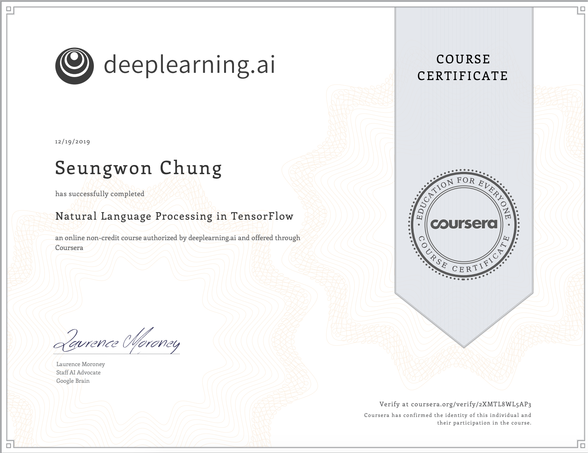

## GOAL

- Certificate
- Complete every project byself
- Be educated

## :woman_student:

## NOTE

[Sentiment in Text](https://github.com/tesschung/TIL-garden/blob/master/Coursera/natural-language-processing-tensorflow/001_SentimentInText.md)

[Word Embeddings](https://github.com/tesschung/TIL-garden/blob/master/Coursera/natural-language-processing-tensorflow/002_WordEmbeddings.md)

[Sequence Models](https://github.com/tesschung/TIL-garden/blob/master/Coursera/natural-language-processing-tensorflow/003_SequenceModels.md)

Sequence Models and Literature

