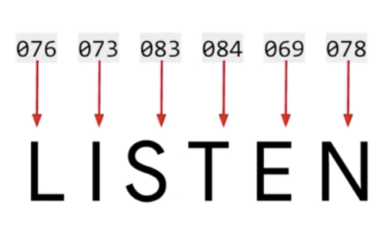
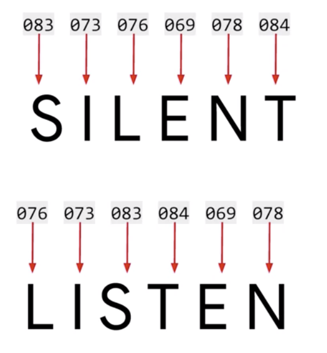
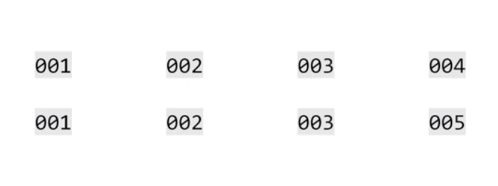

# Sentiment in Text

[TOC]


## Word based encodings



- 단어는 ASCII로 encoding 될 수 있지만 의미론적인 관점에서는 의미를 encoding한다고 볼 수 없다.



- 이런 문제, LISTEN과 SILENT가 encoding된걸 봤을때, encoding된 숫자로만으로는 둘이 같다.
- thus, what about giving a value to each word?
  - give a value per word ( the value will be same for the the same word )
  - I love my dog 
  - I -> 001 love -> 002 my -> 003 dog -> 004
  - I love my **cat** -> generate a new token for a word, **cat**
  - I -> 001 love -> 002 my -> 003 **cat -> 005**



- theres a similarity between the encodings such as 001, 002, 003 (I love my)
- Tensorflow and Care Ask helps to do such things


## Using APIs(Handling Keras)

00_UsingAPIs.py

```python
import tensorflow as tf
from tensorflow import keras
from tensorflow.keras.preprocessing.text import Tokenizer

sentences = [
    'I love my dog',
    'I love my cat'
]

# num_words peramater으로 volume 설정하여, 
# 예측 불가능한 data의 num을 대비하는 것이 중요
tokenizer = Tokenizer(num_words = 100)
# fit_on_texts fit texts on tokenizer and encode
tokenizer.fit_on_texts(sentences)
word_index = tokenizer.word_index

print(word_index) 
# word_index = {'i': 1, 'love': 2, 'my': 3, 'dog': 4, 'cat': 5}
# ! ' ' are cleaned
# same word, same token
# new word, new token
```

- Tokenizer을 사용하여 sentence 내의 word에 tokening을 한다.


## Text to sequence

- tokenizer은 모든 단어를 dictionary화 하여 저장해준다. 키는 word 그리고 값은 num(고유 식별자)으로 만들어진다. {'word':'num'} 

- 이제 이렇게 얻은 token을 가지고, 문장을 목록을 가진 값(lists of values)으로 변환시키는 작업을 할 수 있다.

```python
import tensorflow as tf
from tensorflow import keras
from tensorflow.keras.preprocessing.text import Tokenizer

sentences = [
    'I love my dog',
    'I love my cat',
    'you love my dog!',
    'Do you think my dog is amazing?',
]

tokenizer = Tokenizer(num_words = 100)
tokenizer.fit_on_texts(sentences)
word_index = tokenizer.word_index

sequences = tokenizer.texts_to_sequences(sentences)
print(word_index) # {'my': 1, 'love': 2, 'dog': 3, 'i': 4, 'you': 5, 'cat': 6, 'do': 7, 'think': 8, 'is': 9, 'amazing': 10}
print(sequences) # [[4, 2, 1, 3], [4, 2, 1, 6], [5, 2, 1, 3], [7, 5, 8, 1, 3, 9, 10]]
```

- I love my dog == [4, 2, 1, 3]

  

```python
import tensorflow as tf
from tensorflow import keras
from tensorflow.keras.preprocessing.text import Tokenizer


test_data = [
    'i really love my dog',
    'my dog loves my manatee',
]

tokenizer = Tokenizer(num_words = 100)
tokenizer.fit_on_texts(test_data)
word_index = tokenizer.word_index

test_seq = tokenizer.texts_to_sequences(test_data)
print(word_index)
print(test_seq)
# {'my': 1, 'dog': 2, 'i': 3, 'really': 4, 'love': 5, 'loves': 6, 'manatee': 7}
# [[3, 4, 5, 1, 2], [1, 2, 6, 1, 7]]
```


## Looking more at the Tokenizer

- 많은 데이터 == 많은 vocabs

- an unseen word가 나타나면 ignoring하는 것 보다는 a special value를 줘야한다.


```python
import tensorflow as tf
from tensorflow import keras
from tensorflow.keras.preprocessing.text import Tokenizer

sentences = [
    'I love my dog',
    'I love my cat',
    'you love my dog!',
    'Do you think my dog is amazing?',
]

tokenizer = Tokenizer(num_words = 100, oov_token = "<OOV>") # <OOV> 라는 단어를 outofindex화 하려고한다.
tokenizer.fit_on_texts(sentences)
word_index = tokenizer.word_index

sequences = tokenizer.texts_to_sequences(sentences)

test_data = [
    'i really love my dog',
    'my dog loves my manatee',
]

test_seq = tokenizer.texts_to_sequences(test_data)
print(word_index)
print(test_seq)
print(sequences)
```


## Padding

pad_sequences

모든 문장에 대해서

```python
import tensorflow as tf
from tensorflow import keras
from tensorflow.keras.preprocessing.text import Tokenizer
from tensorflow.keras.preprocessing.sequence import pad_sequences

sentences = [
    'I love my dog',
    'I love my cat',
    'you love my dog!',
    'Do you think my dog is amazing?',
    'I really love my dog',
    'my dog loves my manatee',
]

tokenizer = Tokenizer(num_words = 100, oov_token = "<OOV>") # <OOV> 라는 단어를 outofindex화 하려고한다.
tokenizer.fit_on_texts(sentences)
word_index = tokenizer.word_index
print(word_index)
sequences = tokenizer.texts_to_sequences(sentences)
print(sequences)
padded = pad_sequences(sequences) # 기본 prepadded
print(padded)

'''
padded = 
[[ 0  0  0  5  4  2  3]
 [ 0  0  0  5  4  2  7]
 [ 0  0  0  6  4  2  3]
 [ 8  6  9  2  3 10 11]
 [ 0  0  5 12  4  2  3]
 [ 0  0  2  3 13  2 14]]
'''

padded = pad_sequences(sequences, padding = 'post') # padding을 뒤로 주는 옵션, postpadded
print(padded)
'''
[[ 5  4  2  3  0  0  0]
 [ 5  4  2  7  0  0  0]
 [ 6  4  2  3  0  0  0]
 [ 8  6  9  2  3 10 11]
 [ 5 12  4  2  3  0  0]
 [ 2  3 13  2 14  0  0]]
'''

padded = pad_sequences(sequences, padding = 'post', maxlen=5) # words len 제약을 두는 옵션, postpadded
print(padded)
'''
[[ 5  4  2  3  0]
 [ 5  4  2  7  0]
 [ 6  4  2  3  0]
 [ 9  2  3 10 11]
 [ 5 12  4  2  3]
 [ 2  3 13  2 14]]
'''


padded = pad_sequences(sequences, padding = 'post', truncating='post', maxlen=5) # truncating으로 앞에서부터 제약, postpadded
print(padded)
'''
[[ 5  4  2  3  0]
 [ 5  4  2  7  0]
 [ 6  4  2  3  0]
 [ 8  6  9  2  3]
 [ 5 12  4  2  3]
 [ 2  3 13  2 14]]
'''
```


## Sarcasm, really?

- Text, tokenizing, using APIs
- real world problems => complex sentences

https://rishabhmisra.github.io/

https://github.com/rishabhmisra/Sarcasm-Detection-using-NN


`is_sarcastic` 1 if the record is sarcastic otherwise 0

`headline` the headline of the news article

`article_link` link to the original news article. Useful in collection supplementary data

- parsing하면서 생기는 태그들을 전처리하는 건 현 강의에서는 out of topic이라 headline에만 집중하기로 함


```python
import json

'''
{'is_sarcastic': 1, 'headline': 'life-saving drug more accessible to lab rat than majority of americans', 'article_link': 'https://www.theonion.com/life-saving-drug-more-accessible-to-lab-rat-than-majori-1819578282'}, 
'''
datastore = []
for line in open("Sarcasm-Dataset.json", 'r'):
    datastore.append(json.loads(line))

sentences = []
labels = []
urls = []
for item in datastore:
    sentences.append(item['headline'])
    labels.append(item['is_sarcastic'])
    urls.append(item['article_link'])

```


## Working with the Tokenizer


```python
import json # json 불러오기
'''
{'is_sarcastic': 1, 'headline': 'life-saving drug more accessible to lab rat than majority of americans', 'article_link': 'https://www.theonion.com/life-saving-drug-more-accessible-to-lab-rat-than-majori-1819578282'}, 
'''

datastore = []
for line in open("Sarcasm-Dataset.json", 'r'):
    datastore.append(json.loads(line))

sentences = []
labels = []
urls = []
for item in datastore:
    sentences.append(item['headline'])
    labels.append(item['is_sarcastic'])
    urls.append(item['article_link'])
print(sentences)
print(labels)
print(urls)

from tensorflow.keras.preprocessing.text import Tokenizer
from tensorflow.keras.preprocessing.sequence import pad_sequences

# 딕셔너리 생성
tokenizer = Tokenizer(oov_token='<OOV>')
tokenizer.fit_on_texts(sentences)
word_index = tokenizer.word_index
print(len(word_index)) # 30885
print(word_index)


# sequence 생성
sequences = tokenizer.texts_to_sequences(sentences)

# padding 생성
padded = pad_sequences(sequences, padding='post')
print(sentences[2]) # eat your veggies: 9 deliciously different recipes
print(padded[2]) 
print(padded.shape) # (28619, 152)

'''
padded[2] =
[  863    33 11427   262 16005   647  1484     0     0     0     0     0
     0     0     0     0     0     0     0     0     0     0     0     0
     0     0     0     0     0     0     0     0     0     0     0     0
     0     0     0     0     0     0     0     0     0     0     0     0
     0     0     0     0     0     0     0     0     0     0     0     0
     0     0     0     0     0     0     0     0     0     0     0     0
     0     0     0     0     0     0     0     0     0     0     0     0
     0     0     0     0     0     0     0     0     0     0     0     0
     0     0     0     0     0     0     0     0     0     0     0     0
     0     0     0     0     0     0     0     0     0     0     0     0
     0     0     0     0     0     0     0     0     0     0     0     0
     0     0     0     0     0     0     0     0     0     0     0     0
     0     0     0     0     0     0     0     0]
'''

```


## week 1 quiz


**What is the name of the object used to tokenize sentences?**

**Tokenizer**


**What is the name of the method used to tokenize a list of sentences?**

tokenizer**.fit_on_texts**(sentences)


**Once you have the corpus tokenized, what’s the method used to encode a list of sentences to use those tokens?**

sequences = tokenizer**.texts_to_sequences**(sentences)


**When initializing the tokenizer, how to you specify a token to use for unknown words?**

oov_token=<Token>


**If you don’t use a token for out of vocabulary words, what happens at encoding?**

the word isn't encoded, and is skipped in the sequence


**If you have a number of sequences of different lengths, how do you ensure that they are understood when fed into a neural network?**

:star:  process them on the input layer of the Neural Network using the pad_sequences property


**If you have a number of sequences of different length, and call pad_sequences on them, what’s the default result?**	

they will get padded to the length of the longest sequences by adding zeros to the beginning of shorter ones


## Exercise 1 - Explore the BBC news archive

-  [BBC text archive](http://mlg.ucd.ie/datasets/bbc.html) 에서 tokenize the dataset, removing common stopewords

```python
# !wget --no-check-certificate \
#     https://storage.googleapis.com/laurencemoroney-blog.appspot.com/bbc-text.csv \
#     -O /tmp/bbc-text.csv

import csv
from tensorflow.keras.preprocessing.text import Tokenizer
from tensorflow.keras.preprocessing.sequence import pad_sequences

# Stopwords list from https://github.com/Yoast/YoastSEO.js/blob/develop/src/config/stopwords.js
# Convert it to a Python list and paste it here
stopwords = ["a", "about", "above", "after", "again", "against", "all", "am", "an", "and", "any", "are", "as", "at",
             "be", "because", "been", "before", "being", "below", "between", "both", "but", "by", "could", "did", "do",
             "does", "doing", "down", "during", "each", "few", "for", "from", "further", "had", "has", "have", "having",
             "he", "he'd", "he'll", "he's", "her", "here", "here's", "hers", "herself", "him", "himself", "his", "how",
             "how's", "i", "i'd", "i'll", "i'm", "i've", "if", "in", "into", "is", "it", "it's", "its", "itself",
             "let's", "me", "more", "most", "my", "myself", "nor", "of", "on", "once", "only", "or", "other", "ought",
             "our", "ours", "ourselves", "out", "over", "own", "same", "she", "she'd", "she'll", "she's", "should",
             "so", "some", "such", "than", "that", "that's", "the", "their", "theirs", "them", "themselves", "then",
             "there", "there's", "these", "they", "they'd", "they'll", "they're", "they've", "this", "those", "through",
             "to", "too", "under", "until", "up", "very", "was", "we", "we'd", "we'll", "we're", "we've", "were",
             "what", "what's", "when", "when's", "where", "where's", "which", "while", "who", "who's", "whom", "why",
             "why's", "with", "would", "you", "you'd", "you'll", "you're", "you've", "your", "yours", "yourself",
             "yourselves"]
# print(stopwords)

# sentences = []
# labels = []
# for line in open("bbc-text.csv", 'r'):
#     label, sentence = line.split(',') # , 을 기준으로 column을 나눈다.
#     labels.append(label)
#     sentences.append(sentence)
# sentences = sentences[1:]
#
# print(len(sentences)) # 2225
# print(sentences[0]) # tv future hands viewers home theatre systems plasma high-definition tvs digital video recorders moving living room way people watch tv will radically different five years time. according expert panel gathered annual consumer electronics show las vegas discuss new technologies will impact one favourite pastimes. us leading trend programmes content will delivered viewers via home networks cable satellite telecoms companies broadband service providers front rooms portable devices. one talked-about technologies ces digital personal video recorders (dvr pvr). set-top boxes like us s tivo uk s sky+ system allow people record store play pause forward wind tv programmes want. essentially technology allows much personalised tv. also built-in high-definition tv sets big business japan us slower take off europe lack high-definition programming. not can people forward wind adverts can also forget abiding network channel schedules putting together a-la-carte entertainment. us networks cable satellite companies worried means terms advertising revenues well brand identity viewer loyalty channels. although us leads technology moment also concern raised europe particularly growing uptake services like sky+. happens today will see nine months years time uk adam hume bbc broadcast s futurologist told bbc news website. likes bbc no issues lost advertising revenue yet. pressing issue moment commercial uk broadcasters brand loyalty important everyone. will talking content brands rather network brands said tim hanlon brand communications firm starcom mediavest. reality broadband connections anybody can producer content. added: challenge now hard promote programme much choice. means said stacey jolna senior vice president tv guide tv group way people find content want watch simplified tv viewers. means networks us terms channels take leaf google s book search engine future instead scheduler help people find want watch. kind channel model might work younger ipod generation used taking control gadgets play them. might not suit everyone panel recognised. older generations comfortable familiar schedules channel brands know getting. perhaps not want much choice put hands mr hanlon suggested. end kids just diapers pushing buttons already - everything possible available said mr hanlon. ultimately consumer will tell market want. 50 000 new gadgets technologies showcased ces many enhancing tv-watching experience. high-definition tv sets everywhere many new models lcd (liquid crystal display) tvs launched dvr capability built instead external boxes. one example launched show humax s 26-inch lcd tv 80-hour tivo dvr dvd recorder. one us s biggest satellite tv companies directtv even launched branded dvr show 100-hours recording capability instant replay search function. set can pause rewind tv 90 hours. microsoft chief bill gates announced pre-show keynote speech partnership tivo called tivotogo means people can play recorded programmes windows pcs mobile devices. reflect increasing trend freeing multimedia people can watch want want.

sentences = []
labels = []
with open("bbc-text.csv", 'r') as csvfile:
    reader = csv.reader(csvfile, delimiter=',')
    next(reader)
    for row in reader:
        labels.append(row[0])
        sentence = row[1]
        for word in stopwords:
            token = " " + word + " "
            sentence = sentence.replace(token, " ")
            sentence = sentence.replace("  ", " ")
        sentences.append(sentence)
print(len(sentences))
print(sentences[0])

'''SENTENCES'''
tokenizer = Tokenizer()
tokenizer.fit_on_texts(sentences)
word_index = tokenizer.word_index
print(len(word_index))

sequences = tokenizer.texts_to_sequences(sentences)
padded = pad_sequences(sequences, padding='post')
print(padded[0])
print(padded.shape)

'''LABELS'''
tokenizer = Tokenizer()
tokenizer.fit_on_texts(labels)
label_word_index = tokenizer.word_index
label_seq = tokenizer.texts_to_sequences(labels)
print(label_seq)
print(label_word_index)
```


## :key: Keys

- Tokenizing(encoding) - Sequence - padding


