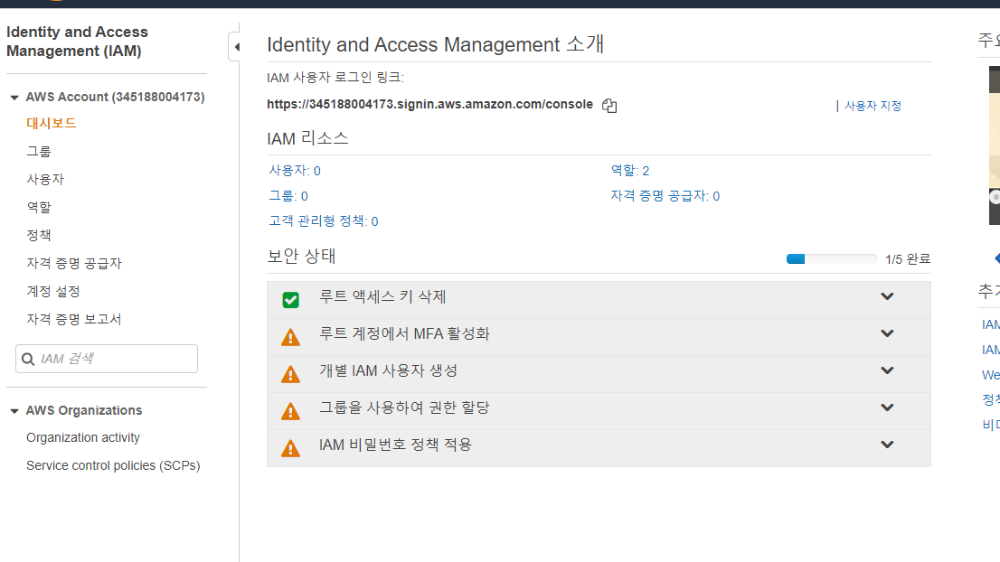
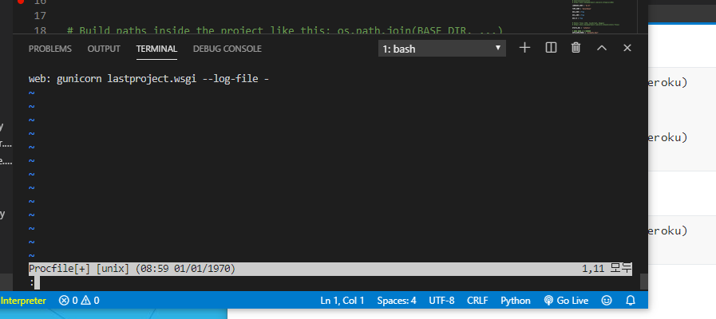
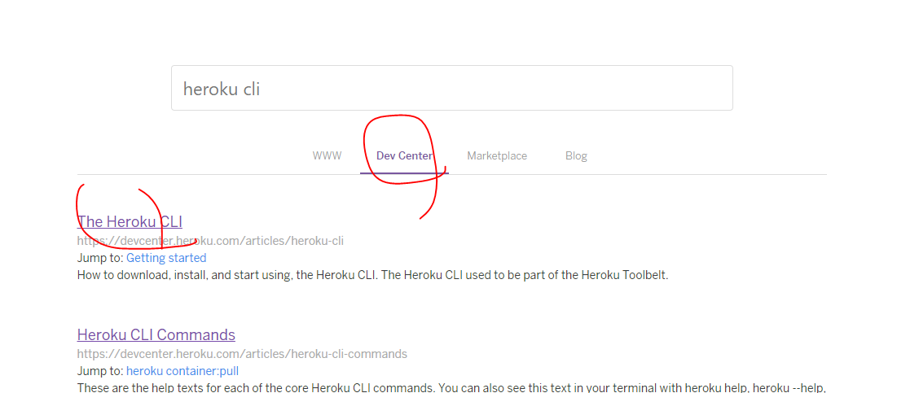

upstream 명령어는 pull할때만


[https://search.daum.net/search?q=%EA%B2%A8%EC%9A%B8%EC%99%95%EA%B5%AD&w=tot&DA=S43](https://search.daum.net/search?q=겨울왕국&w=tot&DA=S43)

https://search.daum.net/search?q=겨울왕국


-> a 태그안에 href="http://movie.daum.net/moviedb/main?movieId=93004"

https://movie.daum.net/moviedb/main?movieId=134130

movieId

a태그 안에서 접근가능

href="/moviedb/photoviewer?id=134130#1340899"

href="/moviedb/photoviewer?id=93004#1341199"


https://movie.daum.net/moviedb/photoviewer?id=134130#1340899/PhotoList

안에 div 존재


# 배포하는 방법


clone

서버 돌릴때 error여부 확인

구글에 배포 -> 2학기때 구글에 배포 할 것이라서

firebase를 사용

hosting해주는 서비스 사용


1. google.com 접속

2. firebase console 검색

3. https://console.firebase.google.com/?hl=ko

4. 프로젝트 만들기 클릭


5. 생성 완료


6. 개발-hosting 클릭

   

hosting 이란?

html에서 js를 불러서 보여주도록 한다

정적인 website를 배포하는데 사용 


7. 시작하기


8. movie-front 에서 설치

```bash
student@M702 MINGW64 ~/Desktop/deploy-test/vue/1126 (master)
$ cd movie-front/

student@M702 MINGW64 ~/Desktop/deploy-test/vue/1126/movie-front (master)
$ npm install -g firebase-tools
```


9. 


10. login 가능 => login하면 구글 이메일로 Issue를 알려준다.

```bash
student@M702 MINGW64 ~/Desktop/deploy-test/vue/1126/movie-front (master)
$ firebase login
Already logged in as makeartweek@gmail.com
```

11. firebase init 명령어 선언

front안에서 한다.

```bash
You're about to initialize a Firebase project in this directory:

  C:\Users\student\Desktop\deploy-test\vue\1126\movie-front

? Are you ready to proceed? Yes
? Which Firebase CLI features do you want to set up for this folder? Press Space to select features, then Enter to confirm your choices. (Press <space> to select, <a> to toggle all, <i> to invert selection)
# 아래 서비스 중에 몇가지를 사용하게 될 것이다.
>( ) Database: Deploy Firebase Realtime Database Rules
 ( ) Firestore: Deploy rules and create indexes for Firestore
 ( ) Functions: Configure and deploy Cloud Functions
 ( ) Hosting: Configure and deploy Firebase Hosting sites
 ( ) Storage: Deploy Cloud Storage security rules
 ( ) Emulators: Set up local emulators for Firebase features
# 지금은 hosting만
```

hosting space->enter 하면 아래와 같이 선택하는게 나온다.

```bash
? Please select an option: Use an existing project
? Select a default Firebase project for this directory: vue-project-36062 (vue-project)
# dist로 선택
? What do you want to use as your public directory? dist
# 매우 중요
# vue는 single page app 이므로 이 부분이 중요하다.
# y를 해줘야 한다.
? Configure as a single-page app (rewrite all urls to /index.html)? (y/N)
? Configure as a single-page app (rewrite all urls to /index.html)? Yes
+  Wrote dist/index.html

i  Writing configuration info to firebase.json...
i  Writing project information to .firebaserc...
i  Writing gitignore file to .gitignore...

+  Firebase initialization complete!
```

12. 아래와 같은 파일이 생성된다.

firebase.json

```json
{
  "hosting": {
    "public": "dist",
    "ignore": [
      "firebase.json",
      "**/.*",
      "**/node_modules/**"
    ],
    "rewrites": [
      {
        "source": "**",
        "destination": "/index.html"
      }
    ]
  }
}

```


13. npm run build

```bash
student@M702 MINGW64 ~/Desktop/deploy-test/vue/1126/movie-front (master)
$ npm run build
```


14. 배포시작

```bash
student@M702 MINGW64 ~/Desktop/deploy-test/vue/1126/movie-front (master)
$ firebase deploy

```


https://vue-project-36062.firebaseapp.com/

배포완료


vue 는

SERVER_IP를

https://vue-project-36062.firebaseapp.com/

으로 대체해야한다

환경변수에 서버 IP를 추가해야한다.

.env.local 파일에

```text
VUE_APP_SERVER_IP='http://127.0.0.1:8000'
BASE_URL = 'http://localhost:8080/'
```


### 이제 drf 를 배포하면 된다.

### django 배포 어려운 점이 많으니 집중


두 가지 방법 존재

- AWS
- 해로쿠


기본데이터를 빼놓고

서버에 올린 후에 채워넣어야 하기때문에

기본 데이터를 빼놓는다.


서버는 데이터가 없는 상태에서 시작

```bash
student@M702 MINGW64 ~/Desktop/deploy-test/vue/1126/movie-back (master)
$ python manage.py migrate
Operations to perform:
  Apply all migrations: accounts, admin, auth, authtoken, contenttypes, diaries, movies, sessions
Running migrations:
  No migrations to apply.
(3.7.4)
```


data를 seeding한다 => fixture 안에 있는 json 데이터로 초기 데이터를 넣어준다.


```bash
student@M702 MINGW64 ~/Desktop/deploy-test/vue/1126/movie-back (master)
$ python manage.py loaddata users.json
```


settings.py

```python
# 아래에 반드시 정보가 들어가있어야 한다.
# 모든 나라에서 허용
ALLOWED_HOSTS = ['*']
```


.env 작성

settings.py에 추가

```python
from decouple import config
```


```bash
student@M702 MINGW64 ~/Desktop/deploy-test/vue/1126/movie-back (master)
$ pip install python-decouple
```


### AWS

https://aws.amazon.com/ko/console/


Root 계정으로 들어간다.


하지만 platform의 sub 계정에서 하는 것이 더욱 안전하다.


서비스 찾기에서 IAM 검색 




사용자:0 클릭


비밀번호 재설정 필요 -> 다른 팀원들에게 관리자 계정을 만들어서 줄 수 있기 때문에 새로운 비밀번호로 바꿀 수 있도록 기회를 주는 것 

현재는 필요없으므로 체크 해제된다.


elasticbeanstalk을 사용하려고 하는 것이다.


다음선택


다음선택

.csv 를 다운로드 받는데,

정말 중요한 파일이므로 local computer에서 항상 지우고 가야한다.

google drive에 저장하면 된다.


csv 파일에 있는

 Console login link 으로 들어가서 console에 로그인한다.


```bash
student@M702 MINGW64 ~/Desktop/deploy-test/vue/1126/movie-back (master)
$ pip freeze > requirements.txt
(3.7.4)
```

https://docs.aws.amazon.com/ko_kr/elasticbeanstalk/latest/dg/create-deploy-python-django.html


#### AWS 배포 시작

1. 설정파일 생성

```bash
student@M702 MINGW64 ~/Desktop/deploy-test/vue/1126/movie-back (master)
$ mkdir .ebextensions
```


settings.json

```json
{
    "python.pythonPath": "movie-back\\venv\\Scripts\\python.exe",
    "files.associations": {
        "**/templates/*.html": "django-html",
        "**/templates/*": "django-txt",
        "**/requirements{/**,*}.{txt,in}": "pip-requirements",
        "**/*.config": "yaml"
    },
}
```


django.config

```config
option_settings:
  aws:elasticbeanstalk:container:python:
    WSGIPath: movieback/wsgi.py
```


db-migrate.config

컴퓨터가 데이터베이스에 접근할 수 있는 권한이 없으므로 

리눅스 컴퓨터가 데이터베이스에 접근할 수 있도록 설정한다.

```config
container_commands:
    01_migrate:
      command: "python manage.py migrate"
      leader_only: true
    02_chown_sqlitedb:
      command: "sudo chown wsgi db.sqlite3"
      leader_only: true
    03_seed:
      command: "python manage.py loaddata actor-data.json"
      leader_only: true
  option_settings:
    aws:elasticbeanstalk:application:environment:
      DJANGO_SETTINGS_MODULE: movieback.settings
```

04_collectstatic:

​	command: "python manage.py collectstatic"

​	leader_only: true

static을 사용하는 경우 위와 같은 명령을 한다.


git commit 할 것 그후 아래와 같이 설치

```bash
student@M702 MINGW64 ~/Desktop/deploy-test/vue/1126/movie-back (master)
$ pip install awsebcli
student@M702 MINGW64 ~/Desktop/deploy-test/vue/1126/movie-back (master)
$ eb --version
EB CLI 3.16.0 (Python 3.7.4)
(3.7.4)
student@M702 MINGW64 ~/Desktop/deploy-test/vue/1126/movie-back (master)
$ eb init
# 어느 지역에 배포할 것인지
Select a default region
1) us-east-1 : US East (N. Virginia)
2) us-west-1 : US West (N. California)
3) us-west-2 : US West (Oregon)
4) eu-west-1 : EU (Ireland)
5) eu-central-1 : EU (Frankfurt)
6) ap-south-1 : Asia Pacific (Mumbai)
7) ap-southeast-1 : Asia Pacific (Singapore)
8) ap-southeast-2 : Asia Pacific (Sydney)
9) ap-northeast-1 : Asia Pacific (Tokyo)
10) ap-northeast-2 : Asia Pacific (Seoul)
11) sa-east-1 : South America (Sao Paulo)
12) cn-north-1 : China (Beijing)
13) cn-northwest-1 : China (Ningxia)
14) us-east-2 : US East (Ohio)
15) ca-central-1 : Canada (Central)
16) eu-west-2 : EU (London)
17) eu-west-3 : EU (Paris)
18) eu-north-1 : EU (Stockholm)
19) ap-east-1 : Asia Pacific (Hong Kong)
20) me-south-1 : Middle East (Bahrain)
(default is 3): # 10
You must provide your credentials.
(aws-access-id): # csv에 있는 Access key ID
(aws-secret-key): # Secret access key

```


d3f4c65ccd0ec21a9fd6bd2448ad48288177e55d

#### heroku 배포 시작

https://www.heroku.com/ 회원가입


front/back이 나뉘어 있는 경우 다르게 작성

branch를 따로 친다.

```bash
student@M702 MINGW64 ~/Desktop/deploy-test/vue/1126 (eb-deploy)
$ git checkout -b heroku
Switched to a new branch 'heroku'
M       .vscode/settings.json
```


front를 지운다.

등등 바깥쪽에 movie-back안에 있는 것만 제외하고 모두 지운후 밖으로 옮긴다.


```bash
student@M702 MINGW64 ~/Desktop/deploy-test/vue/1126 (heroku)
$ git add .
(3.7.4)
student@M702 MINGW64 ~/Desktop/deploy-test/vue/1126 (heroku)
$ git commit -m "Django deployment"
```

heroku 설치

```bash
student@M702 MINGW64 ~/Desktop/deploy-test/vue/1126 (heroku)
$ pip install django-heroku
student@M702 MINGW64 ~/Desktop/deploy-test/vue/1126 (heroku)
$ vi Procfile
```

i를 눌러서 끼워넣기



esc wq


아래와 같이 Procfile생성 된다.


```bash
student@M702 MINGW64 ~/Desktop/deploy-test/vue/1126 (heroku)
$ pip install gunicorn
student@M702 MINGW64 ~/Desktop/deploy-test/vue/1126 (heroku)
$ pip freeze > requirements.txt
# 다시 requirements.txt추가
```

requirements.txt는 건드릴 것들이 있어서 계속 켜둘 것

requirements.txt에 있는 경우 아래를 지울 것! 반드시

pypiwin32==223

pywin32==227


runtime.txt 생성


환경변수와 ALLOWED_HOSTS 처리


heroku 홈으로 들어가기


heroku cli 검색




전부 next 를 눌러서 다운로드 하면된다.


모든 vs를 끄고 해당 명령어를 치면, 다음과 같이 결과가 나온다.


```ba
student@M702 MINGW64 ~/Desktop/deploy-test/vue/1126 (heroku)
$ heroku login
heroku: Press any key to open up the browser to login or q to exit:
Opening browser to https://cli-auth.heroku.com/auth/browser/9e90343e-76de-439c-b735-444de45ce6e6
Logging in... done
Logged in as geobera0910@naver.com
```

login 후 다시 vs로.


```bash
student@M702 MINGW64 ~/Desktop/deploy-test/vue/1126 (heroku)
$ heroku create tess-indong-api-server
Creating ⬢ tess-indong-api-server... done
https://tess-indong-api-server.herokuapp.com/ | https://git.heroku.com/tess-indong-api-server.git
# 아래와 같이 remote 확인 가능
student@M702 MINGW64 ~/Desktop/deploy-test/vue/1126 (heroku)
$ git remote -v
heroku  https://git.heroku.com/tess-indong-api-server.git (fetch)
heroku  https://git.heroku.com/tess-indong-api-server.git (push)
```


heroku에 환경변수 직접 세팅


API key도 동일하게 작업하면 된다.


```bash
student@M702 MINGW64 ~/Desktop/deploy-test/vue/1126 (heroku)
$ git add .
warning: LF will be replaced by CRLF in Procfile.
The file will have its original line endings in your working directory

student@M702 MINGW64 ~/Desktop/deploy-test/vue/1126 (heroku)
$ git commit -m "Deploy to heroku"

# heroku에 있는 master라는 branch에 올린다.
student@M702 MINGW64 ~/Desktop/deploy-test/vue/1126 (heroku)
$ git push heroku heroku:master

```

