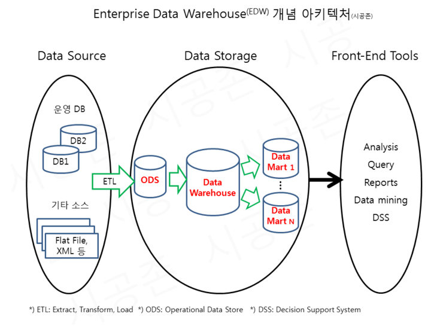
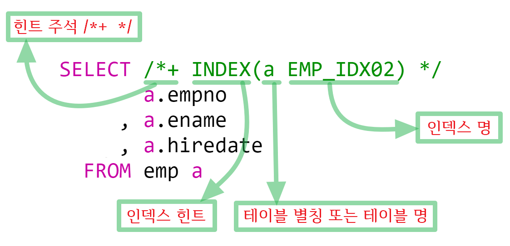
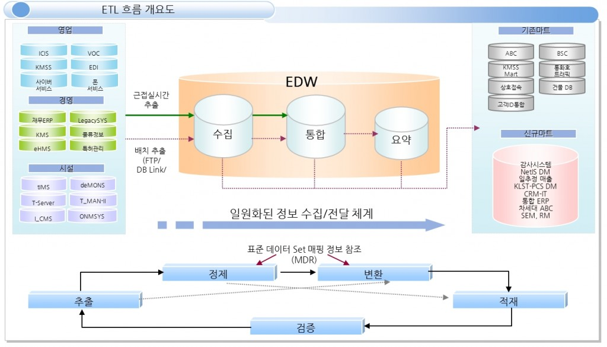

EDW REC RED

관리회계의 관리주체는 현지 관리직원

Enterprise Data Warehouse (EDW) 개념 아키텍처

이전: 

log 로 진행

이후: 

BCV

**운영계 시스템**
기업 운영에 필요한 업무용 시스템이며, 이 시스템의 사용자는 직원이 될 수도 있고, 외부 고객이 될 수도 있습니다. 예를 들어 전자상거래 사이트에서 물건을 주문했을 경우, 인터넷뱅킹 사이트에서 이체를 진행했을 경우, 내부 인사시스템의 사원 정보를 갱신하는 경우와 같이 프로세스가 모두 운영계 시스템에서 처리됩니다. 이 시스템에 발생하는 데이터는 대부분 데이터베이스 트랜잭션 단위로 데이터를 처리하고, 저장하며 흔히 OLTP(Online Transaction Processing) 데이터라고 표현합니다.

금융권에서 운영계시스템을 분류하여 기간계, 계정계, 정보계, 대외계와 같은 용어를 사용합니다.

**1. 기간계(Legacy, Existing)**

  1) 정의 : 고객이 사용하던 **기존 시스템**(새로운 시스템 도입 기준시점 AS-IS)

**2. 계정계**

  1) 정의 : 금융권 영업점에서 실시간으로 고객의 **거래를 처리하기 위한 업무** 정보.

  2) 사용 예 : 고객의 통장 정보(계좌 번호, 입ㆍ출금, 이체, 펀드, 주식 등)

**3. 정보계**

  1) 정의 : **거래의 이력 데이터를 관리**하고, 그 데이터의 **통계 및 분석**하는 시스템.

  2) 특징 : 저장된 데이터를 바탕으로 앞으로의 예측, 결산, 분석 등의 업무를 처리.

​      정보계에서 데이터로의 접근성에 대한 속도가 중요.

**4. 대외계**

  1) 정의 : 각 금융기관의 **대내외 망을 연결하는 시스템**

  2) 사용 예 : 전자금융, 사이버 증권, 기업 뱅킹, CD공동망, 신용 정보

 

위 4가지 용어 모두 시스템을 나타내고 있는데요

시스템이 어느 시점, 어느 구간에서 구축이 되었는가를 구분하기 위해서 사용하고 있습니다.

 

**ODS**
 운영계 시스템의 데이터는 트랜잭션을 중심으로 설계되어 있기 때문에, 운영계 시스템 데이터를 대상으로 데이터 분석을 진행할 경우 효용성이 매우 떨어집니다. 그래서 데이터 분석을 위한 DW(Data Warehouse)를 설계하고, 데이터를 보관하게 됩니다. ODS는 **EDW로 데이터를 저장하기 전에**, **임시로 운영계 데이터를 보관하는 장소**이며, 운영계 시스템의 **이력성 데이터를 보관**을 하게 됩니다. 참고로 ODS가 별도로 존재할 경우에는 운영계 시스템의 **복사본으로 활용**되며, DW의 일부일 경우에는 임시 저장소로 사용됩니다. 

 

**EDW의 정의**
ODS를 거쳐 운영 데이터베이스(Operational Database) 및 외부 데이터 Source로부터 필요 데이터를 추출하여, **경영분석/의사결정의 지원을 위해 최적화된 구조로 변환된 데이터베이스.**

 

***\*EDW\**의 특징**

  **1. 주제 중심적** (Subject oriented) 

  **2. 통합적** Integrated) 

  **3. 계열적** (Time Variant Historical)

  **4. 장기 지속적** (Non-Volatile) 

**DM** (Data Mart)
OLAP분석의 편의성을 높이고자, EDW의 데이터를 주제별, 업무별로 요약하여 구성한 데이터 저장소입니다. 일반적으로 각 부서별로 다양한 예측과 분석을 목표로 만들어집니다.

**OLAP**
고객의 업무를 분석하고 다차원 모델링을 활용하여 Data Mart를 구축하고, OLAP (On Line Analysis Process)를 구현함으로써, 시각화 도구, 데이터 마이닝 시스템이 이 분류에 포함됩니다. 

**ETL**(Extraction, Transform, Load)
ETL은 데이터를 추출, 가공, 적재하는 프로세스입니다. 운영계 시스템과 ODS, ODS와 DW, DW와 DM간에 ETL이 진행됩니다. 

 

### # CDC

실시간으로 원천 데이터의 변경 사항을 감지하여 이관하는작업이 CDC(Change Data Capture)이다.

다양한 방법으로 캡쳐를 진행하나, 로그를 읽어 변경을 반영하는 방법과 통신을 통한 변경이 주로쓰인다.

현업에서 CDC란 용어는 실시간데이터가 반영된 EDW 그 자체를 칭하기도 한다.

### # ETL

그리고 데이터를 이관하기위해 추출, 변환, 적재라는 일련의 과정을 거치는데 이를 ETL이라고 한다. 

ETL 도구로는 **SSIS**(MS-SQL), **ODI**(Orcle), **ESF** 등이 있다.

 

### # ODS

현재는 ODS가 staging과 같은의미로 1차적인 데이터 수집공간(temporary)으로 표현되곤한다.

EDW로 이관을 위한 중간단계 데이터로, 원천데이터의 복사본으로 사용한다.

 

