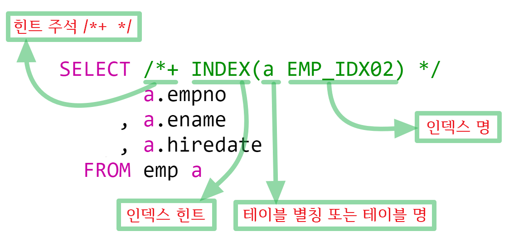

힌트를 사용하여 사용자가 선택하는 execution plan을 사용하도록 

*주석에 꼭 **"+"**를 붙여야 힌트절이 실행되며 "+"가 없으면 일반 주석으로 간주하고 아무런 이벤트가 없다.

인덱스태우기

**인덱스 힌트 간단 정리**

 

적절한 인덱스 힌트를 사용하면 쿼리의 수행 속도를 향상시킨다

ORDER BY를 사용하지 않아도 인덱스의 컬럼 순서로 정렬되어 조회된다

**INDEX** (INDEX_ASC) : 오름차순 정렬, **INDEX_DESC** : 내림차순 정렬

멀티라인 주석 ( **/\*+ \*/** )과 싱글라인 주석( **--+** ) 모두 인덱스 힌트를 사용할 수 있다

여러개의 복한 인덱스 힌트를 사용할 수 있다 ( **/\*+ INDEX(.....) INDEX(.....) \*/** )

**/\*+ ALL_ROWS \*/**
목적 : Best Throughput
용 도 : 전체 RESOURCE 소비를 최소화 시키기 위한 힌트. Cost-Based 접근방식으로 ALL_ROWS는 Full Table Scan을 선호하며 CBO(Cost Based Optimization)는 default로 ALL_ROWS를 선택한다.

예 :
SELECT **/*+ALL_ROWS */**
EMPNO,ENAME
FROM EMP
WHERE EMPNO = 7655;

**/\*+ FIRST_ROWS \*/**
목적 : Best Response Time
용도 : 조건에 맞는 첫번째 row를 리턴하기 위한 Resource 소비를 최소화 시키기위한 힌트이며 Cost-Based 접근방식을 사용.
특징 

​    \- Index Scan 이 가능하다면 Optimizer가 Full Table Scan 대신 Index Scan을 선택한다.
​    \- Index Scan 이 가능하다면 Optimizer가 Sort-Merge 보다 Nested Loop 을 선택한다.
​    \- Order By절에의해 Index Scan이 가능하면, Sort과정을 피하기위해 Index Scan을 선택한다.
​    \- Delete/Update Block 에서는 무시된다.
​    \- 다음을 포함한 Select 문에서도 제외된다.
​      집합연산자 (UNION, INTERSECT, MINUS, UNION ALL)
​      Group By
​      For UpDate
​      Group 함수
​      Distinct

​    \- Full Table Scan보다는 index scan을 선호하며 Interactive Application인 경우 best response time을 제공 한다
​    \- sort merge join보다는 nested loop join을 선호한다.

 

**/\*+ CHOOSE \*/**
목적 : Acess되는 테이블에 통계치 존재여부에 따라 Optimizer로 하여금 Rule-Based Approach와 Cost-Based Approach 중 하나를 선택할 수 있게 한다.
용 도 : Data Dictionary가 해당테이블에 대해 통계정보를 가지고 있다면 Optimizer는 Cost-Based Approach를 선택하고, 그렇지 않다면 Rule-Based Approach를 선택한다. Hint Level의 CHOOSE는 RBO(Rule Based Optimization)인지 CBO(Cost Based Optimization) 인지를 선택 한다. 만약 주어진 table의 통계 정보가 없다면 Rule Based 접근 방식을 사용 한다.

 

**/\*+ RULE \*/**
: Rule Based 접근 방식을 사용하도록 지정 한다.

 

<<Access Methods - 접근 방법>>

 

**/\*+ FULL(table_name) \*/**
: Table을 Full Scan하길 원할 때 사용

 

**/\*+ HASH(table) \*/**
: Hash scan을 선택하도록 지정 (HASHKEYS Parameter로 만들어진 Cluster내에 저장된 Table에만 적용)

**/\*+ CLUSTER(table_name) \*/**
: Cluster Scan을 선택하도록 지정. 따라서 Clustered Object만 적용

**/\*+ HASH_AJ \*/**
: NOT IN SubQuery 를 HASH Anti-join으로 변형

 

**/\*+ HASH_SJ \*/**
: Correlated Exists Subquery 를 Hash Semi-join으로 변형

**/\*+ INDEX(table_name index_name) \*/**
: 지정된 index를 강제적으로 쓰게끔 지정
 \- in list predicat에 대해서도 가능.
 \- Multi-column inlists 는 index 를 사용할 수 없다.

**/\*+ INDEX_COMBINE(table_name index_name) \*/**
: Index명이 주어지지 않으면 Optimizer는 해당 테이블의 Best Cost 로 선택된 Boolean Combination Index 를 사용하며 Index 명이 주어지면 주어진 특정 Bitmap Index 의 Boolean Combination 의 사용

 

**/\*+ INDEX_ASC(table_name index_name) \*/**
: 지정된 index를 오름차순으로 쓰게끔 지정(기본은 오름차순)

 

**/\*+ INDEX_DESC(table_name index_name) \*/**
: 지정된 index를 내림차순으로 쓰게끔 지정
   SQL>SELECT /*+ index_desc(emp pk_emp) */ empno
      FROM emp
      WHERE rownum = 1 ;
   (위 문장은 제일 큰 것 하나만 조회되므로, max function의 기능을 대신할 수 있다.)

 

**/\*+ INDEX_FFS(table index) \*/**
: Full table scan보다 빠른 Full index scan을 유도

 

**/\*+ ROWID(table) \*/**
: Rowid로 Table Scan을 하도록 지정

 

**/\*+MERGE_AJ\*/**
: NOT IN Subquery를 Merge Anti-join으로 변형

 

**/\*+MERGE_SJ\*/**
: Correalted EXISTS Subquery를 Merge Semi-join으로 변형

 

**/\*+AND_EQUAL(Table Index1, Index2...) \*/**
: Single-Column Index의 Merge를 이용한 Access Path 선택. 적어도 두개이상의 Index가 지정되어야한다. Max로 5개까지 지정 가능

 

**/\*+USE_CONCAT\*/**
: 조건절의 OR 를 UNION ALL 형식으로 변형한다. 일반적으로 변형은 비용측면에서 효율적일때만 일어난다.

 

 

<<Join Orders>>

**/\*+ ORDERED \*/**
: From절에 기술된 테이블 순서대로 join이 일어나도록 유도

 

**/\*+ STAR\*/**
: Star Query Plan이 사용가능하다면 이를 이용하기 위한 Hint. Star Plan은 규모가 가장큰 테이블이 Query에서 Join Order상 마지막으로 위치하게 하고 Nested Loop 으로 Join이 일어나도록 유도한다. 적어도 3개 테이블 이상이 조인에 참여해야하며 Large Table의 Concatenated Index는 최소 3컬럼 이상을 Index에 포함해야한다. 테이블이 Analyze 되어 있다면 Optimizer가 가장효율적인 Star Plan을 선택한다.

 

 

<<Join Operations>>

 

**/\*+ USE_NL(table1 table2 ...) \*/**
: 테이블의 Join 시 테이블의 각 Row가 Inner 테이블을 Nested Loop 형식으로 Join 한다. 지정된 table이 inner table이 된다. ( inner table <-> driving(outer) table )
흔히 ORDERED Hint와 함께 쓴다.

**/\*+ USE_HASH (table_name) \*/**
: 각 테이블간 HASH JOIN이 일어나도록 유도 한다

 

**/\*+ USE_MERGE (table_name) \*/**
: 지정된 테이블들의 조인이 SORT-MERGE형식으로 일어나도록 유도 한다.

**/\*+ DRIVING_SITE(table_name) \*/**
: QUERY의 실행이 ORACLE에 의해 선택된 SITE가 아닌 다른 SITE에서 일어나도록 유도.

 

<<Parallel Execution>>

**/\*+ NOPARALLEL(table_name) \*/**
: Parallel Query Option을 사용하지 않도록 할 수 있음.

 

**/\*+ PARALLEL(table_name, degree) \*/**
: PARALLEL hint를 사용하면 query에 포함된 table의 degree를 설정할 수 있다. 예를 들어, 다음과 같이 hint를 적어 degree 4로 parallel query option을 실행하도록 할 수 있다. 이 때 parallel이란 글자와 괄호( '(' )사이에 blank를 넣지 않도록 주의해야 함

=> DEGREE의 의미 및 결정
 \- Parallel Query에서 degree란 하나의 operation 수행에 대한 server process의 개수를 의미하며 이러한 degree 결정에 영향을 주는 요인들에는 다음과 같은 것들이 있다.
  (1) system의 CPU 갯수
  (2) system의 maximum process 갯수
  (3) table이 striping되어 있는 경우, 그 table이 걸쳐있는 disk의 갯수
  (4) data의 위치 (즉, memory에 cache되어 있는지, disk에 있는지)
  (5) query의 형태 (예를 들어 sorts 혹은 full table scan)

  SQL>SELECT /*+ PARALLEL(emp, 4) */ * FROM emp;

 

<<Additional Hints>>

 

**/\*+ CACHE(table) \*/**
: full table scan시 retrieve된 block을 LRU list에서 most recently used end에 놓는다.
 즉, memory에 오래 존재하게 한다.

 

**/\*+ NOCACHE(table) \*/**
: full table scan시 retrieve된 block을 LRU list에서 least recently used end에 놓는다.
 즉, memory에서 금방 내려가게 한다.

 

**/\*+ MERGE(view) \*/**
: COMPLEX_VIEW_MERGING = FALSE 로 되어 있을 때 view 또는 subquery의 내용을 merge가능.

 

**/\*+ NOMERGE(view) \*/**
: COMPLEX_VIEW_MERGING = TRUE 로 되어 있을 때 사용
 view 또는 subquery의 내용을 merge불가능.
 view 또는 subquery자체의 query문에 의한 영향을 많이 받게됨.

 

**/\*+ PUSH_SUBQ \*/**
: nomerged subqueries가 execution plan에서 가능한 가장 빠른 위치에서 evaluation되도록 한다.
 일반적으로, merge되지 않은 subqueries는 execution plan에서 마지막 step으로써 수행된다.
 subqueries가 상대적으로 inexpensive하고 rows의 수를 줄일 수 있다면, subqueries를 더 일찍 evaluation하는 것이 performance를

 향상시킬 것이다.
 subquery가 remote table에 적용되거나, merge join을 사용하는 join된 table에 적용된다면 이 hint는 적용되지 않는다.

 

**/\*+ START TRANSFORMATION \*/**