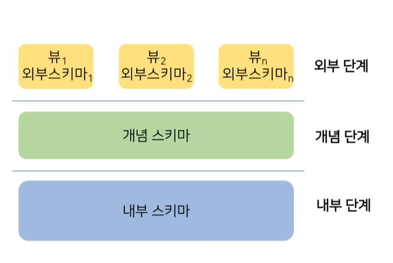

## 01

​       **파일 처리 시스템**

1. 파일을 사용하여 업무에 해당하는 데이터를 관리하는 방

   **데이터베이스 관리 시스템(DBMS)**

2. 정보를 데이터베이스에 저장·관리하여 사용자에게 요구된 형태의 정보로 제공하는 컴퓨터 기반 시스템

   **DBMS 3단계 구조**

3. 데이터 추상화와 데이터 독립성을 확보하기 위한 개념적-논리적-물리적 3단계 구조

   **트랜잭션**

4. 하나의 논리적인 작업을 수행하는 일련의 데이터베이스 명령의 집합

1. 기존 전산 시스템, 스마트 기기, 소셜 미디어, IoT 센서 등 사회 트렌드의 변화로 대량의 데이터가 저장 및 활용되고 있어 데이터 관리가 점차 중요해지고 있다.
2. ------

3. **파일 처리 시스템**은 프로그램이 직접 데이터에 접근하여 데이터를 저장 및 사용하는 **데이터의 중복성, 데이터의 종속성, 데이터의 무결성 훼손,** 그리고 **동시 접근 이상의 문제점**을 내포한다.

**다음 중 파일 처리 시스템의 데이터 중복으로 발생할 수 있는 문제가 아닌 것은**

- 보안성 
- 경제성
- **통일성**
- 일관성

부연설명 : 파일 처리 시스템은 데이터 중복을 방지할 수 없으며 이로 인에 데이터의 **보안성, 경제성, 일관성** 측면에서 문제가 발생한다.

1. ------

2. **데이터베이스**는 파일 처리 시스템과 달리 **자기 기술성, 추상화, 다중 뷰, 동시성 제어** 등의 기능을 통해 파일 처리 시스템의 문제점을 극복한다.

3. ------

4. 데이터베이스 시스템은 3단계 구조, 즉 **외부 단계, 개념 단계 그리고 내부 단계**로 구성된다. 외부 단계는 사용자 뷰를 나타내며, **개념 단계**는 데이터베이스의 **논리적인 전체 구조**를 나타내고, 내부 단계는 데이터가 기억장소에 저장되기 위한 물리적 구조를 정의한다.

   

**데이터베이스** **3**단계 구조에서 논리적 데이터 독립성이 확보되는 과정은?

외부-개념 사상

부연설명 : DBMS는 데이터의 추상화를 위해 외부-개념-내부 3단계로 구조화되며 **외부-개념 사상 과정에서** **논리적 데이터 독립성**, 개념-내부 사상을 통해 물리적 데이터 독립성이 확보된다.

1. ------

2. 각 단계 간의 접속에서 특정 외부 스키마와 개념 스키마 간의 대응 관계를 정의한 외부-개념 사상과, 개념 스키마와 내부 스키마 간의 대응 관계를 정의한 개념-내부 사상에 의해 연관성을 갖는다.
3. ------

4. 데이터베이스 언어란 데이베이스 사용을 위한 언어 형태의 인터페이스로 **데이터 정의 언어(DDL)**와 **데이터 조작 언어(DML)**로 구성된다.
5. ------

6. DBMS는 전체 시스템을 구성하는 방식에 따라 중앙집중식과 분산 시스템 방식으로 아키텍처를 구성할 수 있다.

## 02

