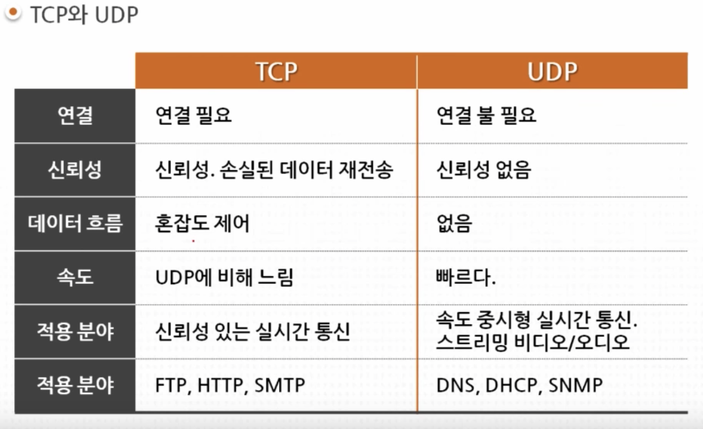
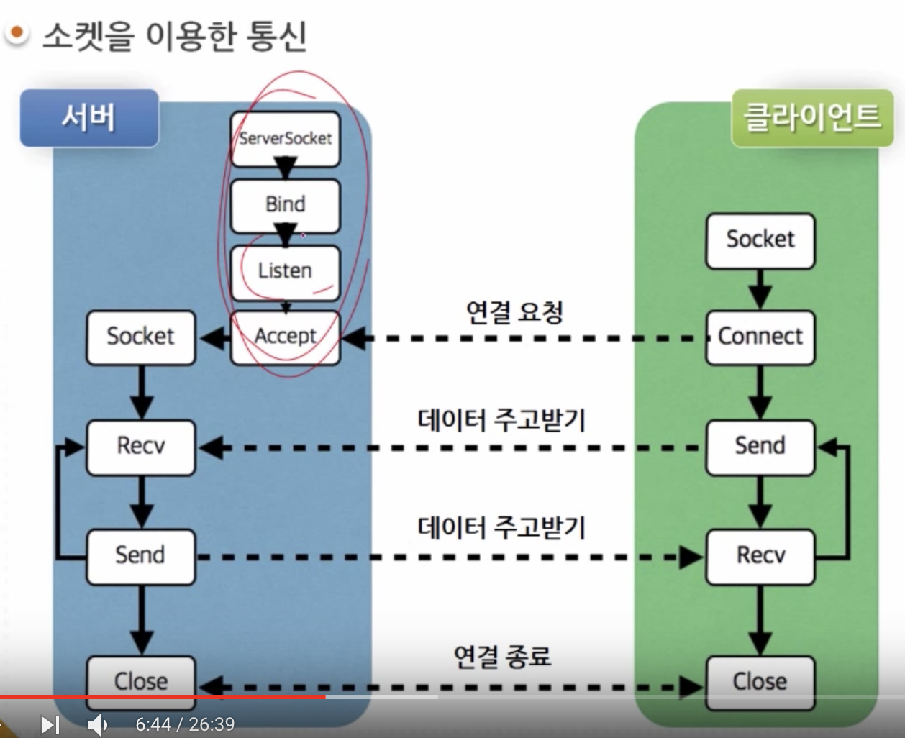
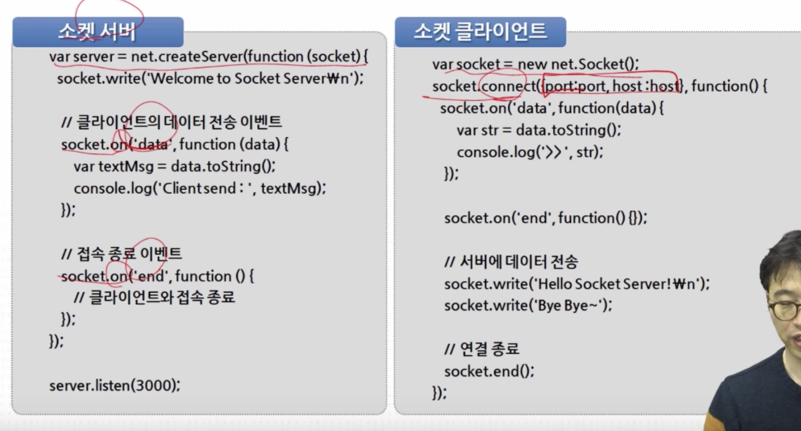
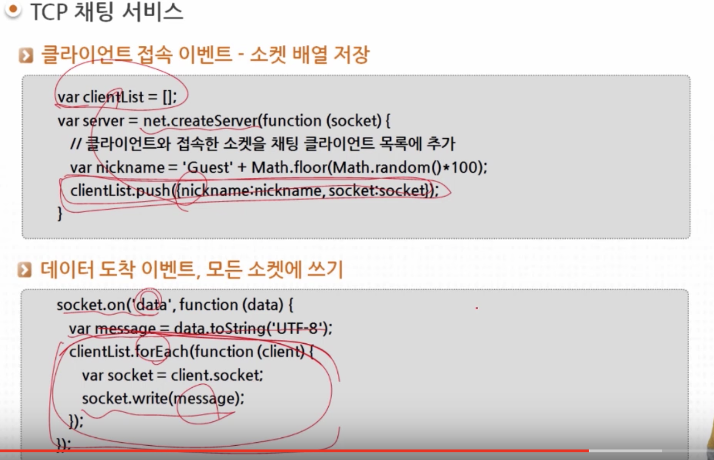
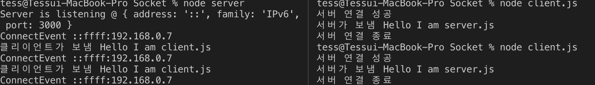
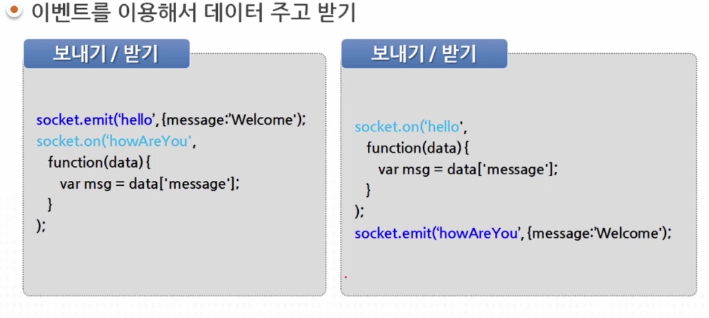

### 프로세스간 통신

#### Inter Process Communication

두 개의 프로세스 상호간에 데이터를 주고받는 방법


### 멀티플렉싱


https://www.youtube.com/watch?v=Sio5Qc-zp-w

## Socket을 이용한 실시간 서비스

실시간 노래 배틀 서비스 구현 중에 게임룸의 모든 데이터를 socket.io로 연결하기로 했다.

- 실시간 서비스

   예) 실시간 공연 예약 서비스

   	- 사용자가 선택한 공연 정보 전달
   	- 예약 가능한 공연 날짜와 좌석정보
   	- 실시간으로 예약 가능한 시간과 좌석 정보 반영
   	- 다른 사용자가 예약 -> 예약 좌석 상황 반영
   	- 실시가능로 가능한 자리 선택 후 예약

-> 이러한것은 HTTP로 구현이 힘들다

- HTTP 통신은 요청과 응답 기반
- 다시 요청할때까지 변경사항 반영안됨


-> 그래서 TCP/UDP이용

*TCP* 통신

- 네트워크 레이어: Transport Layer
- stream을 이용한 실시간 통신
- 소켓을 이용한 네트워크 프로그래밍


-> 

소켓(socket)

​	은 통신 접점이 된다.

통신 접점(Entry point)

소켓 프로그래밍

	- 데이터 그램 소켓 : UDP
	- 스트림 소켓 : TCP




- TCP
  - 연결 지향이므로 연결 과정 필요
  - 연결 과정
    - 1. **서버 소켓 생성**, 준비, 대기
      2. **클라이언트 소켓** 연결, 소켓간 **연결**
      3. 데이터 교환
      4. 접속 끊기

소켓을 이용한 통신 과정




데이터를 주고 받는 것은 스트림 기반

보내기 write

받기 read


- UDP

-> 넘어감, 지금 안씀

- net 모듈

  ```js
  var net = require('net')
  
  net.Server  // 서버-클라이언트는 socket을 통해 연결된다.
  net.Socket
  
  // 서버 생성
  var server = net.createServer([option][,connectionListener])
  
  // 서버 함수
  server.listen(port[,host][,backlog][,callback])
  // -> 클라이언트 접속 대기
  server.close([callback])
  // -> 추가 접속을 받지 않는다.
  server.getConnections(callback)
  // -> 연결 개수
  server.address()
  // -> 서버 주소
  ```

**net.server 이벤트**

net.server - listening -> fork binding, 접속가능상태(accessible status event)

net.server - connection -> client connection event

net.server - close -> close server when theres no socket connected

net.server - error


서버를 생성하고 connect해보는 코드

서버코드

```js
var server = net.createServer(function(socket){
  console.log('ConnectEvent', socket.remoteAddress)
  // connectEvent 
  // 
});

// 이벤트 핸들 등록
server.on('listening', function(){
  console.log('Server is listening @', server.address()) // console에는 접속가능한 server.address()의 주소가 찍힌다.
});
server.on('close', function(){
  console.log('ServerClose')
});

```


클라이언트코드

```js
var socket = new net.Socket()
var option = {
  host = 'localhost',
  port = 3000
};

socket.connect(option, function(){
  // connect한다
});
```


**net.Socket 이벤트**

- connect :  원격 소켓 연결 이벤트
- **data : 읽을 수 있는 데이터 도착**
- end : 원격 호스트의 소켓 종료 FIN
- timeout
- error


**net.Socket 함수, 프로퍼티**

- connect(options[,connectListener]) 연결
- write(data[,encoding] [,callback]) 데이터쓰기

- end([data] [,encoding]) 연결 종료 신호 FIN 보내기
- setKeepAlive([enable] [,initialDelay]) 연결 유지
- remoteAddress, remotePort 원격 호스트 주소와 포트


연결되어있다는 가정 하에 데이터쓰기write를 통해 데이터 전달

클라이언트 코드

```js
socket.write('Hello Node.js')
```

서버코드

```js
socket.on('data', function(chunk){
  // 데이터 도착
});
socket.on('end', function(){
  // 원격 호스트의 종료
})
```



:star: 15:00

createServer해서 서버를 만든다

소켓 객체를 만든다.

만들어진 소켓객체를 받아 write함수를 통해 프로퍼티를 보낸다.

해당 welcome... 이라는 **데이터**를 클라이언트는 소켓.on에서 data(이벤트로서의 데이터)라는 이벤트로 **데이터**(값으로서의 데이터)를 받는다


서버에서 write함수를 통해 전달하는 경우 클라이언트쪽에서 data이벤트가 발생한다.

end를 하면 서버에서 end이벤트가 발생한다.


**이를 통해 채팅서비스 가능**

- 서버소켓준비
- 클라이언트 소켓 연결
- 소켓을 이용한 데이터 교환

**더 고려해야 할 사항**

이제 1:N으로 데이터를 전달해야 한다.

채팅 관련 명령어: 닉네임 변경, 1:1대화, 채팅방 나가기

소켓을 이용한 서비스: **데이터 전달 + 제어 명령어 전달**



클라이언트가 접속하면, 닉네임과 소켓정보를 clientList에 담는다.

데이터가 쓰여지면 해당 데이터를 모든 소켓을 돌면서 전달한다.


message -> 제어코드


전체코드

서버

```js
var net = require('net')

var server = net.createServer(function(socket){
  console.log('ConnectEvent', socket.remoteAddress)
  socket.write('Hello I am server.js')

  socket.on('data', function (chunk) {
    // 데이터 도착
    console.log('클리이언트가 보냄',
    chunk.toString())
  });
  socket.on('end', function () {
    // 원격 호스트의 종료
  })
});

server.on('listening', function(){
  console.log('Server is listening @', server.address()) // console에는 접속가능한 server.address()의 주소가 찍힌다.
});

server.on('close', function(){
  console.log('ServerClose')
});

server.listen(3000);
```


클라이언트

```js
var net = require('net')
var socket = new net.Socket()

var ip = '192.168.0.7'
var port = 3000

socket.connect({host:ip, port:port}, function () {
    console.log('서버 연결 성공')
    // connect한다
    socket.write('Hello I am client.js')
    socket.end();

    socket.on('data', function (chunk) {
        // 데이터 도착
        console.log('서버가 보냄',
        chunk.toString())
    });
    socket.on('end', function () {
        // 원격 호스트의 종료
        console.log('서버 연결 종료')
    })

});
```




-> 신기하다.. 채팅 만들러가야징


### 실시간 웹서비스 원리

다양한 웹 브라우저가 있어서 실시간 웹서비스를 하는게 좀 어려웠음

크롬, 익스 등 다르니까.

```cmd
npm install socket.io
```


**서버**

- http 서버
- **Socket.io 서버**

**클라이언트(웹 브라우저)**

- http 클라이언트
- **Socket.io 클라이언트**


**서비스 시작**

http 서버 준비

Socket.io 서버 준비

socket.io **클라이언트** 요청 -> html로 응답

socket.io 클라이언트 초기화 및 서버 접속


두 서버 준비

웹 서버 -> http, express

Socket.io 서버


socket.io 클라이언트 이벤트

connect

error

disconnect

Reconnect reconnecting reconnect_error...

서버와 연결 끊어지면 자동 재접속 시도


**메세지 전송**

이벤트 발생 Socket.emit()

Socket.emit('event', **data**)

-> 이벤트를 발생시킨다.


**메세지 수신**

이벤트 리스너 등록 Socket.on()

socket.on('event', function(**data**){}) -> 'event'에 반응하도록한다

-> 이벤트를 받는다.




-> 서버와 클라이언트를 나누지 않은이유는

둘 다 가능하기 때문

서버에서도 보낼 수 있고, 클라이언트에서도 보낼 수 있다.


**이벤트로 메세지 주고받기**

- 서버에 이벤트 등록 - 클라이언트에서 이벤트 발생
- 클라이언트 이벤트 등록  - 서버에서 이벤트 발생


**서버에서의 이벤트 발생** **두 가지**

소켓 하나에 이벤트 발생 1:1

Socket.emit('Direct Event', [data])

연결된 모든 소켓에 이벤트 발생 1:N

socket.io.emit('broadcast Event', [data]) // io.emit으로도 가능


네임스페이스

- 같은 네임스페이스에서만 메세지 주고 받음
- /name-space 이런식으로 정의해서 등록

io.of 이런식으로


룸

- 네임스페이스 내 채널
- 같은 룸에서만 데이터 교환
- 룸에 입장, 여러 움에 입장가능
- 룸에서 떠나기